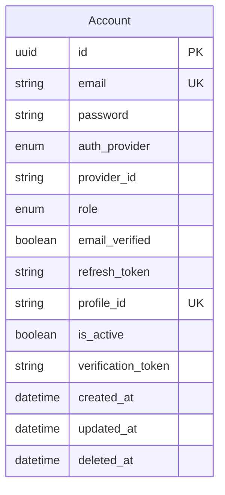

# authservice

Dịch vụ xác thực và tài khoản: đăng ký/đăng nhập, OAuth2 client, JWT (JJWT), soft-delete tài khoản. Liên kết logic tới profile qua khóa `profile_id` (UUID string, không FK JPA sang profile DB).

## Công nghệ

| Thành phần | Phiên bản / ghi chú |
| --- | --- |
| Java | 21 |
| Spring Boot | 3.5.11 |
| Web, Validation | REST API |
| Spring Security + OAuth2 Client | Bảo mật / đăng nhập mạng xã hội |
| Spring Data JPA + MySQL | `mysql-connector-j` |
| JJWT | 0.12.5 |
| Google API / OAuth client | Tích hợp Google |
| Spring Kafka | Sự kiện (producer/consumer theo cấu hình) |
| OpenAPI | springdoc |
| Lombok | Entities/DTOs |
| Phụ thuộc nội bộ | `commonjpa`, `commonservice` |

## Mô hình dữ liệu (JPA)

**Ghi chú:** `profile_id` là tham chiếu cross-service tới `profileservice`, không phải `@ManyToOne` trong code.
