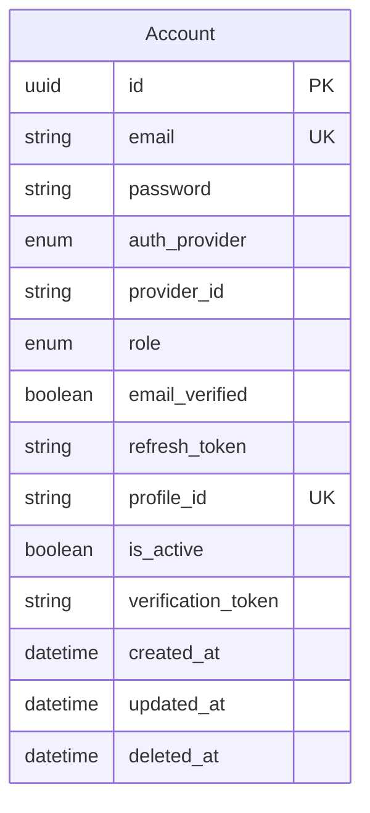
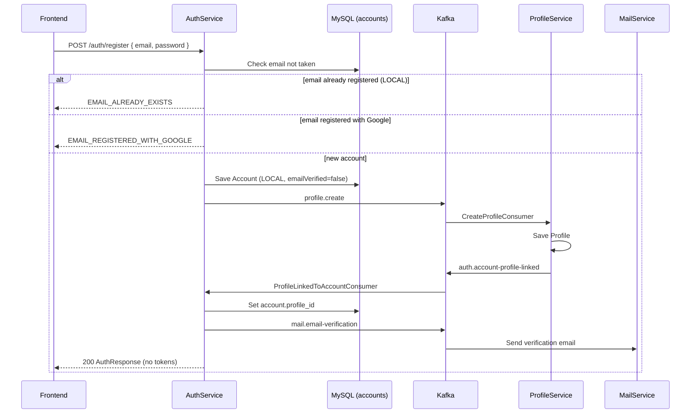
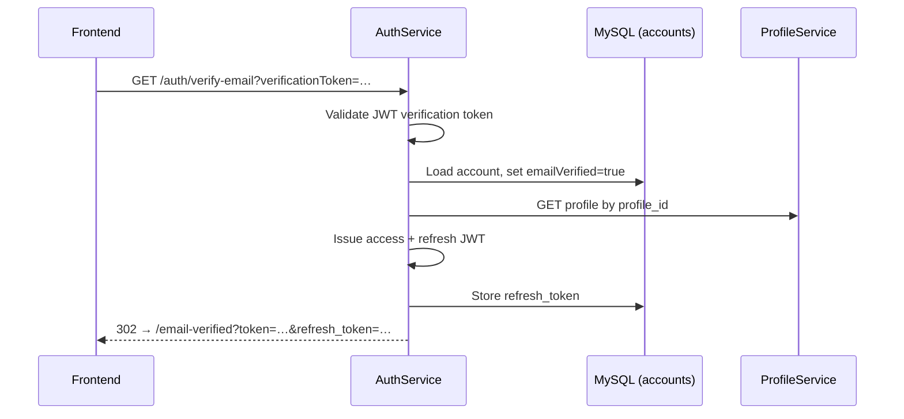
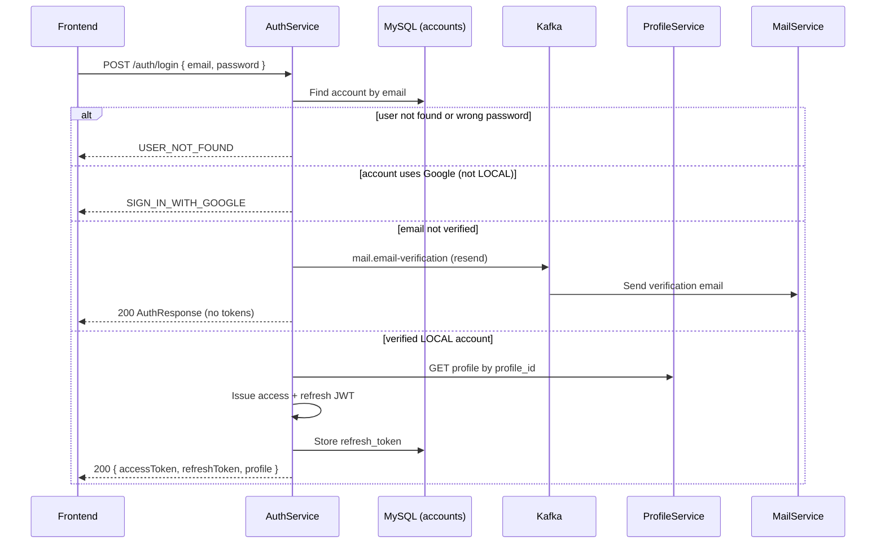
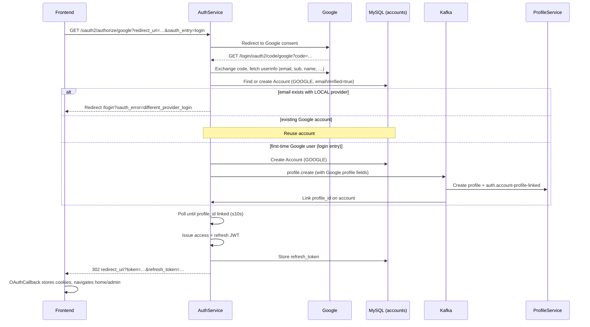
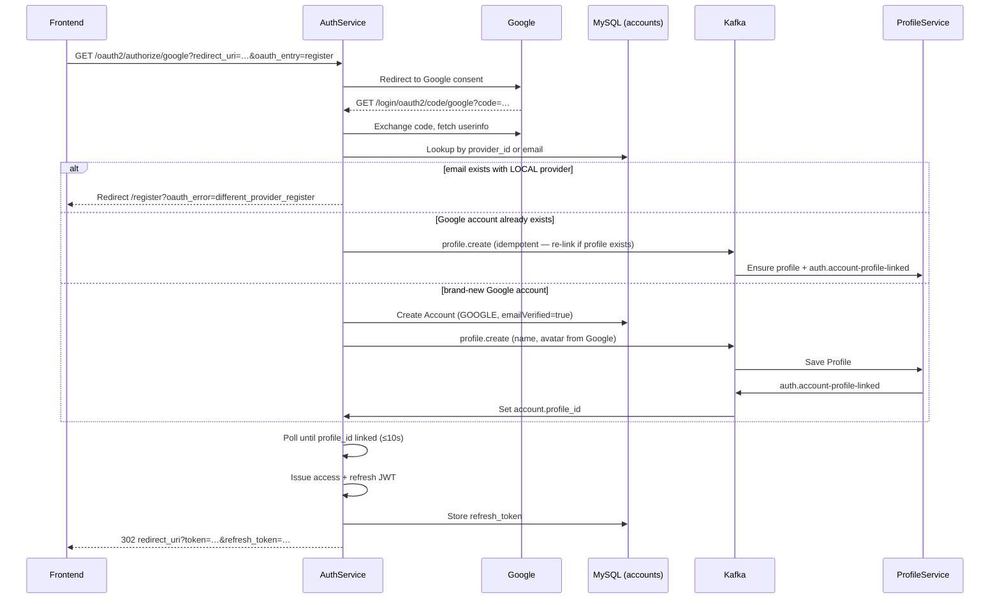

# authservice

Authentication and account service: registration/login, OAuth2 client, JWT (JJWT), account soft-delete. Links to profiles via `profile_id` (UUID string, cross-service reference — no JPA FK to the profile database).

## Stack

| Component | Version / notes |
| --- | --- |
| Java | 21 |
| Spring Boot | 3.5.11 |
| Web, Validation | REST API |
| Spring Security + OAuth2 Client | Security / social login |
| Spring Data JPA + MySQL | `mysql-connector-j` |
| JJWT | 0.12.5 |
| Google API / OAuth client | Google integration |
| Spring Kafka | Events (producer/consumer per config) |
| OpenAPI | springdoc |
| Lombok | Entities / DTOs |
| Internal deps | `commonjpa`, `commonservice` |

## Data model (JPA)

**Note:** `profile_id` is a cross-service reference to `profileservice`, not a `@ManyToOne` in this codebase.

## Auth flows

Base path: `/api/v1`. Kafka topics: `profile.create`, `auth.account-profile-linked`, `mail.email-verification`.

### Register — email + password

Returns an **empty** `AuthResponse` (no tokens). The user must verify email before logging in.

After the user opens the verification link:

### Login — email + password

Admin accounts skip profile fetch in the login response (`profile = null`).

### Google — login (`oauth_entry=login`)

Entry URL (via gateway):  
`GET /oauth2/authorize/google?redirect_uri={frontendCallback}&oauth_entry=login`

### Google — register (`oauth_entry=register`)

Same OAuth redirect dance; `CustomOAuth2UserService` reads `oauth_entry=register` from cookie.

Google sign-in **does not** send a verification email (`emailVerified=true` on create). No password is stored.

## Common environment variables

| Variable | Description |
|------|--------|
| `SERVER_PORT_AUTH_SERVICE` | HTTP port (default `8081`) |
| `MYSQL_URL` / `MYSQL_USERNAME` / `MYSQL_PASSWORD` | Account database |
| `JWT_SECRET` | Signing key for access / refresh / verification tokens |
| `GOOGLE_CLIENT_ID` / `GOOGLE_CLIENT_SECRET` | Google OAuth client |
| `FRONTEND_URL` | SPA base URL (verify-email redirect, OAuth error pages) |
| `KAFKA_BOOTSTRAP_SERVERS` | Kafka broker |
| `PROFILE_SERVICE_URL` | Profile API (login profile fetch) |
