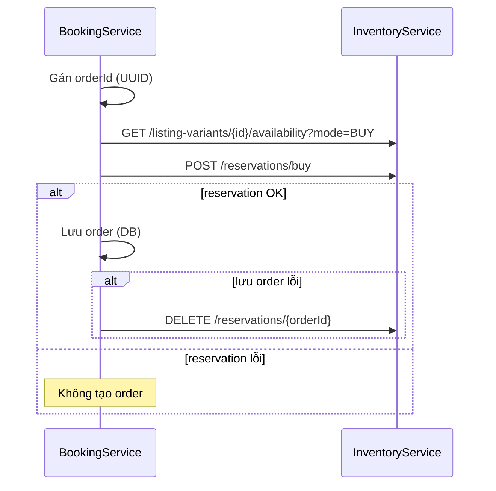

# Booking Service

Service xử lý đơn đặt hàng (booking order): kiểm tra tồn kho BUY, tạo reservation đồng bộ qua **inventory service**, rồi lưu order (có rollback nếu lưu order thất bại).

- **Context path:** `/api/v1`
- **Port mặc định:** `8087` (`SERVER_PORT_BOOKING_SERVICE`)
- **Kafka topic:** `inventory.reservation.create` (config: `spring.kafka.topics.create-inventory-reservation`)

## Yêu cầu

- Java 21
- Maven 3.9+
- MySQL (`MYSQL_URL`, `MYSQL_USERNAME`, `MYSQL_PASSWORD`)
- Kafka (`KAFKA_BOOTSTRAP_SERVERS`, mặc định `localhost:9092`)
- Inventory service (`INVENTORY_SERVICE_URL`) — kiểm tra stock và consumer reservation

## Cấu hình local

```bash
cp src/main/resources/application-dev.yml.example src/main/resources/application-dev.yml
```

Chỉnh DB, Kafka, và URL inventory (tránh trùng port với inventory service):

```bash
export SERVER_PORT_BOOKING_SERVICE=8088
export INVENTORY_SERVICE_URL=http://localhost:8087/api/v1
export KAFKA_BOOTSTRAP_SERVERS=localhost:9092
```

Chạy với profile `dev`:

```bash
mvn spring-boot:run -Dspring-boot.run.profiles=dev
```

Hoặc từ root repo (build kèm `commonservice`):

```bash
mvn spring-boot:run -pl bookingservice -am -Dspring-boot.run.profiles=dev
```

## Chạy test

Module phụ thuộc `commonservice` (enum `ErrorCode`, v.v.). Nếu test báo `NoSuchFieldError: INSUFFICIENT_INVENTORY`, cần bản `commonservice` mới trong workspace (xem lệnh bên dưới).

### Toàn bộ test của bookingservice

Từ thư mục `bookingservice`:

```bash
mvn test
```

`pom.xml` đã cấu hình compile `commonservice` trước test và dùng `../commonservice/target/classes` trên classpath.

### Từ root repo (khuyến nghị)

```bash
mvn test -pl bookingservice -am -Dsurefire.failIfNoSpecifiedTests=false
```

`-am` build thêm các module phụ thuộc (`commonservice`, `commonjpa`, …).

### Chỉ một vài class test

```bash
mvn test -Dtest=BookingOrderServiceImplTest,CreateInventoryReservationProducerTest
```

### Cài lại commonservice (khi chạy test trong IDE bị lỗi ErrorCode cũ)

```bash
mvn clean install -pl commonservice -DskipTests
```

Sau đó chạy lại test trong IDE hoặc `mvn test` trong `bookingservice`.

### Test liên quan inventory (module khác)

```bash
mvn test -pl inventoryservice \
  -Dtest=InventoryReservationServiceImplTest,CreateInventoryReservationConsumerTest \
  -Dsurefire.failIfNoSpecifiedTests=false
```

## Luồng tạo reservation sau mua (BUY)



1. Kiểm tra stock: `GET /listing-variants/{id}/availability?mode=BUY`.
2. Gán `orderId` (UUID) → **đồng bộ** `POST /reservations/buy` tạo reservation (`PENDING`).
3. Lưu order; nếu lưu DB lỗi → `DELETE /reservations/{orderId}` (release).
4. Nếu bước 2 lỗi (hết hàng, không có item) → **không** tạo order.

`inventoryReservationId` = `orderId`. Kafka consumer vẫn hỗ trợ event async (cùng logic `createBuyReservation`).

## Biến môi trường thường dùng

| Biến | Mô tả |
|------|--------|
| `SERVER_PORT_BOOKING_SERVICE` | HTTP port |
| `MYSQL_URL` / `MYSQL_USERNAME` / `MYSQL_PASSWORD` | Database |
| `KAFKA_BOOTSTRAP_SERVERS` | Kafka broker |
| `KAFKA_TOPIC_CREATE_INVENTORY_RESERVATION` | Topic tạo reservation |
| `INVENTORY_SERVICE_URL` | Base URL inventory API |
