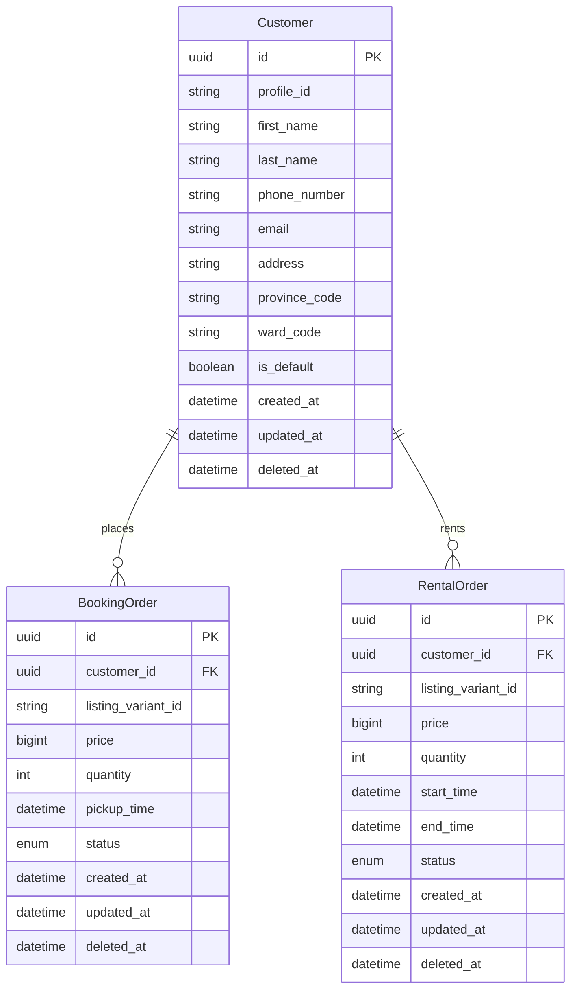
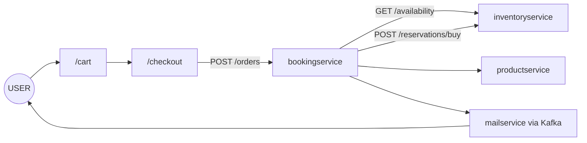
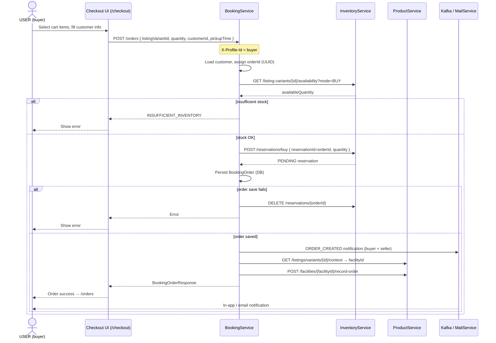
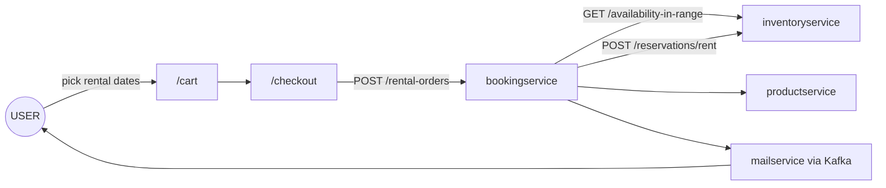
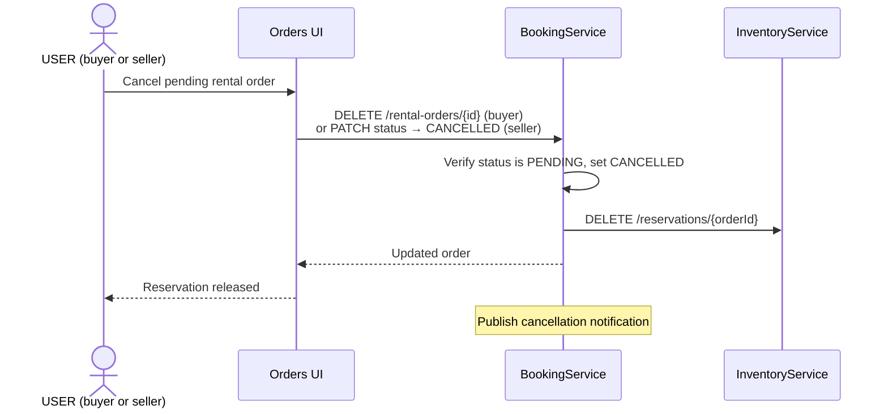

# bookingservice

Handles purchase and rental orders: validates BUY stock, creates inventory reservations synchronously via **inventoryservice**, then persists the order (with rollback if persistence fails).

- **Context path:** `/api/v1`
- **Default port:** `8087` (`SERVER_PORT_BOOKING_SERVICE`)
- **Kafka topic:** `inventory.reservation.create` (config: `spring.kafka.topics.create-inventory-reservation`)

## Stack

| Component | Version / notes |
| --- | --- |
| Java | 21 |
| Spring Boot | Web, Validation, Data JPA |
| MySQL | |
| Spring Kafka | Reservation events |
| Internal deps | `commonjpa`, `commonservice` |

## Data model (JPA)

`listing_variant_id` references product-service listing variants (cross-service, no JPA FK). `Customer.profile_id` references `profileservice`.



## Requirements

- Java 21
- Maven 3.9+
- MySQL (`MYSQL_URL`, `MYSQL_USERNAME`, `MYSQL_PASSWORD`)
- Kafka (`KAFKA_BOOTSTRAP_SERVERS`, default `localhost:9092`)
- Inventory service (`INVENTORY_SERVICE_URL`) — stock checks and reservation consumer

## Local setup

```bash
cp src/main/resources/application-dev.yml.example src/main/resources/application-dev.yml
```

Configure DB, Kafka, and inventory URL (avoid port clash with inventory service):

```bash
export SERVER_PORT_BOOKING_SERVICE=8088
export INVENTORY_SERVICE_URL=http://localhost:8087/api/v1
export KAFKA_BOOTSTRAP_SERVERS=localhost:9092
```

Run with the `dev` profile:

```bash
mvn spring-boot:run -Dspring-boot.run.profiles=dev
```

Or from the repo root (builds `commonservice` as well):

```bash
mvn spring-boot:run -pl bookingservice -am -Dspring-boot.run.profiles=dev
```

## Tests

The module depends on `commonservice` (`ErrorCode`, etc.). If tests fail with `NoSuchFieldError: INSUFFICIENT_INVENTORY`, rebuild `commonservice` in the workspace (see below).

### All bookingservice tests

From `bookingservice/`:

```bash
mvn test
```

`pom.xml` compiles `commonservice` before tests and puts `../commonservice/target/classes` on the classpath.

### From repo root (recommended)

```bash
mvn test -pl bookingservice -am -Dsurefire.failIfNoSpecifiedTests=false
```

`-am` also builds dependent modules (`commonservice`, `commonjpa`, …).

### Selected test classes

```bash
mvn test -Dtest=BookingOrderServiceImplTest,CreateInventoryReservationProducerTest
```

### Reinstall commonservice (when IDE tests use stale ErrorCode)

```bash
mvn clean install -pl commonservice -DskipTests
```

Then rerun tests in the IDE or `mvn test` in `bookingservice`.

### Inventory-related tests (other module)

```bash
mvn test -pl inventoryservice \
  -Dtest=InventoryReservationServiceImplTest,CreateInventoryReservationConsumerTest \
  -Dsurefire.failIfNoSpecifiedTests=false
```

## Order flows

Checkout is initiated by a signed-in **USER** from `/checkout`. Traefik forward-auth injects `X-Profile-Id`; bookingservice orchestrates inventory reservation, order persistence, notifications, and facility metrics.

### BUY — checkout flow (User)





1. Check stock: `GET /listing-variants/{id}/availability?mode=BUY`.
2. Assign `orderId` (UUID) → **sync** `POST /reservations/buy` creates a `PENDING` reservation.
3. Save order; on DB failure → `DELETE /reservations/{orderId}` (release).
4. If step 2 fails (out of stock, no item) → **do not** create an order.
5. After a successful save: publish `ORDER_CREATED` via Kafka (mailservice notifications).
6. **Increment facility metrics (best-effort):** resolve `facilityId` from listing variant context, then  
   `POST /facilities/{facilityId}/record-order` → `Facility.orderCount += 1` in product-service.  
   Failures are logged only; the order is **not** rolled back.

`inventoryReservationId` equals `orderId`. The Kafka consumer still supports async reservation events (same `createBuyReservation` logic).

### RENT — checkout flow (User)



```mermaid
sequenceDiagram
  actor User as USER (buyer)
  participant UI as Checkout UI (/checkout)
  participant B as BookingService
  participant I as InventoryService
  participant P as ProductService
  participant K as Kafka / MailService

  User->>UI: Select rent items + rental window
  UI->>B: POST /rental-orders { listingVariantId, startTime, endTime, quantity, customerId }
  Note over B: X-Profile-Id = buyer
  B->>B: Validate startTime before endTime; load customer; assign orderId
  B->>I: GET /listing-variants/{id}/availability-in-range?mode=RENT&from=&to=
  I-->>B: min available quantity in slot
  alt insufficient rent slots
    B-->>UI: INSUFFICIENT_INVENTORY
    UI-->>User: Show error
  else slots OK
    B->>I: POST /reservations/rent { rentalSlotStart, rentalSlotEnd, quantity, referenceId=orderId }
    alt reservation OK
      B->>B: Persist RentalOrder (status=PENDING)
      alt order save fails
        B->>I: DELETE /reservations/{orderId}
        B-->>UI: Error
        UI-->>User: Show error
      else order saved
        B->>K: ORDER_CREATED notification (buyer + seller)
        B->>P: GET /listings/variants/{id}/context → facilityId
        B->>P: POST /facilities/{facilityId}/record-order
        B-->>UI: RentalOrderResponse
        UI-->>User: Order success → /orders
        K-->>User: In-app / email notification
      end
    else reservation fails
      B-->>UI: Error
      UI-->>User: Show error
    end
  end
```

1. Validate rental window: `endTime` must be after `startTime`.
2. Resolve the buyer's `Customer` record and assign `orderId` (UUID).
3. Check concurrent rent capacity for the slot:  
   `GET /listing-variants/{id}/availability-in-range?mode=RENT&from={startTime}&to={endTime}`.
4. **Sync** `POST /reservations/rent` with `rentalSlotStart`, `rentalSlotEnd`, `quantity`, and `referenceId = orderId`.
5. Save `RentalOrder` (`status = PENDING`); on DB failure → `DELETE /reservations/{orderId}`.
6. After a successful save: publish rent `ORDER_CREATED` notification.
7. **Increment facility metrics (best-effort):** same as BUY —  
   `GET /listings/variants/{id}/context` → `POST /facilities/{facilityId}/record-order`.

Reservation payload uses `mode = RENT`. `inventoryReservationId` equals `orderId` (same pattern as BUY).

### RENT — cancel while PENDING

Applies when the **USER** (buyer) cancels or the seller rejects a pending rent order.



Seller status transitions after confirmation:  
`PENDING → CONFIRMED → DELIVERED → RETURNED → COMPLETED`  
(with `PENDING → CANCELLED` releasing the reservation).

## Common environment variables

| Variable | Description |
|------|--------|
| `SERVER_PORT_BOOKING_SERVICE` | HTTP port |
| `MYSQL_URL` / `MYSQL_USERNAME` / `MYSQL_PASSWORD` | Database |
| `KAFKA_BOOTSTRAP_SERVERS` | Kafka broker |
| `KAFKA_TOPIC_CREATE_INVENTORY_RESERVATION` | Reservation topic |
| `INVENTORY_SERVICE_URL` | Inventory API base URL |
| `PRODUCT_SERVICE_URL` | Product API base URL (listing context + `record-order`) |
