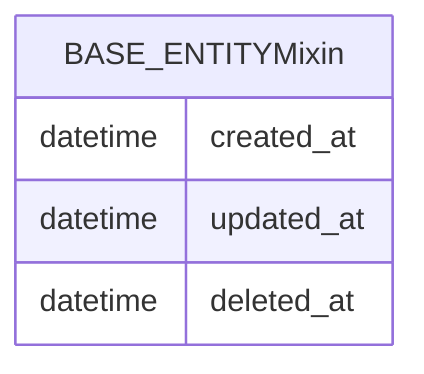

# commonjpa

Thư viện JPA dùng chung cho các service trong monorepo Second Life.

## Công nghệ

| Thành phần | Phiên bản / ghi chú |
| --- | --- |
| Java | 21 |
| Hibernate ORM | Theo Spring Boot 3.5.11 |
| Jakarta Persistence | API chuẩn JPA |
| Lombok | Annotation processing |

Module **không phải** ứng dụng độc lập: được đóng gói `jar` và khai báo `dependency` trong các service.

## Mô hình dữ liệu (JPA)

Chỉ có `@MappedSuperclass`, không map thành bảng riêng.

- **`BaseEntity`**: trường audit `created_at`, `updated_at`, `deleted_at` + hook `@PrePersist` / `@PreUpdate`.
- **`@SoftDelete`** + listener / Hibernate integrator: hỗ trợ soft-delete ở các entity con (khi service cấu hình tương ứng).

*(Trong thực thi JPA, các entity service con kế thừa và kế thừa các cột trên vào bảng tương ứng.)*
