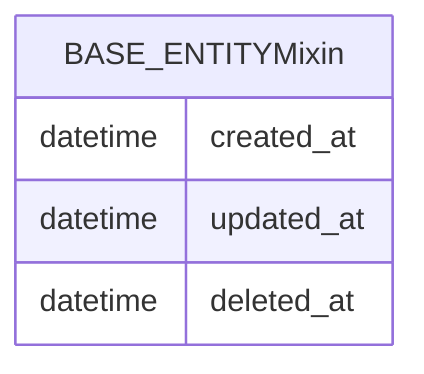

# commonjpa

Shared JPA library for Second Life monorepo services.

## Stack

| Component | Version / notes |
| --- | --- |
| Java | 21 |
| Hibernate ORM | Via Spring Boot 3.5.11 |
| Jakarta Persistence | Standard JPA API |
| Lombok | Annotation processing |

This module is **not** a standalone application: it is packaged as a `jar` and declared as a `dependency` in services.

## Data model (JPA)

Only `@MappedSuperclass` types — not mapped to their own tables.

- **`BaseEntity`**: audit fields `created_at`, `updated_at`, `deleted_at` + `@PrePersist` / `@PreUpdate` hooks.
- **`@SoftDelete`** + listener / Hibernate integrator: soft-delete support on child entities (when the service configures it).

*(In JPA, service entities extend this mixin and inherit the columns above into their tables.)*

## Main flows

**N/A** — shared JPA library only. Provides `BaseEntity` audit columns and soft-delete support; no runtime service or API.
