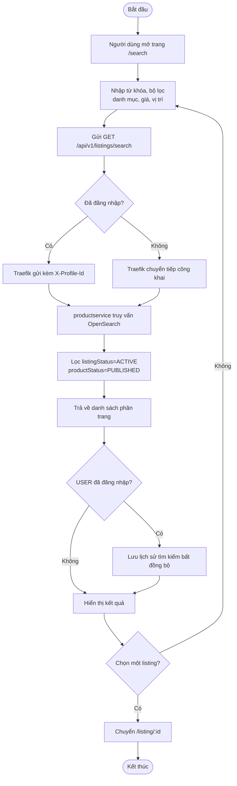
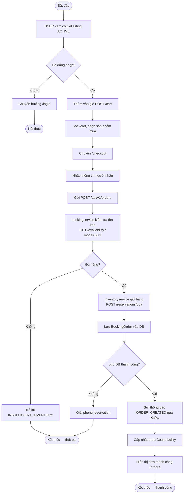
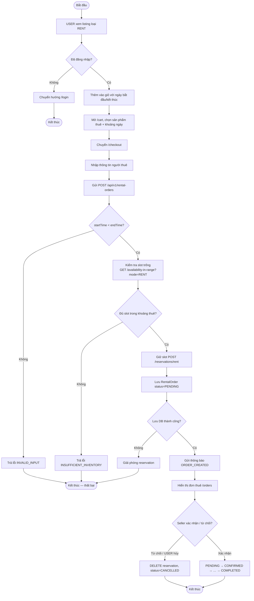
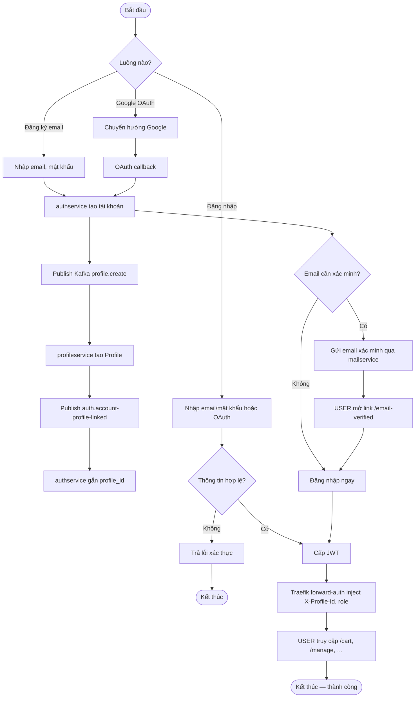
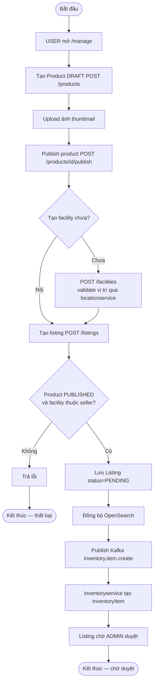
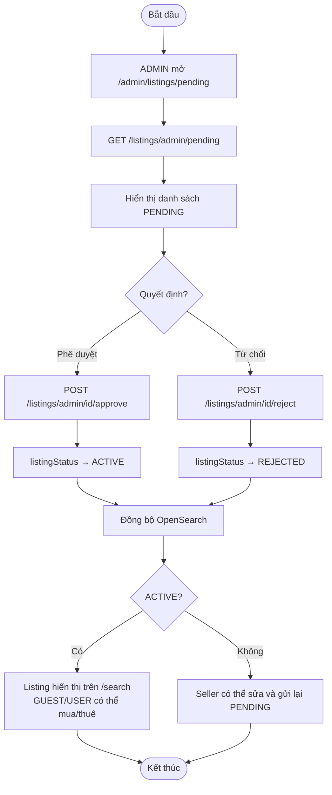

# Sơ đồ hoạt động — luồng nổi bật

Các luồng chính của hệ thống **Second Life**, dùng cho báo cáo đồ án. Chi tiết sequence diagram theo từng service: [architecture.md](./architecture.md) và README từng microservice.

| Luồng | Actor | Services liên quan |
|-------|-------|-------------------|
| [Tìm kiếm sản phẩm](#1-tìm-kiếm-sản-phẩm) | GUEST / USER | productservice, OpenSearch |
| [Mua hàng (BUY)](#2-mua-hàng-buy) | USER | productservice, bookingservice, inventoryservice, mailservice |
| [Thuê sản phẩm (RENT)](#3-thuê-sản-phẩm-rent) | USER | productservice, bookingservice, inventoryservice, mailservice |
| [Đăng ký & đăng nhập](#4-đăng-ký--đăng-nhập) | GUEST → USER | authservice, profileservice, mailservice |
| [Người bán đăng listing](#5-người-bán-đăng-listing) | USER (seller) | productservice, inventoryservice, locationservice |
| [Admin duyệt listing](#6-admin-duyệt-listing) | ADMIN | productservice, OpenSearch |

---

## 1. Tìm kiếm sản phẩm

GUEST và USER đều truy cập `/search` mà không bắt buộc đăng nhập. USER đã đăng nhập có thêm lưu lịch sử tìm kiếm.

Chi tiết: [productservice/README.md](../productservice/README.md#public-listing-search)

---

## 2. Mua hàng (BUY)

USER phải đăng nhập. Luồng: thêm giỏ → chọn sản phẩm → checkout → giữ tồn kho → tạo đơn → thông báo.

Chi tiết: [bookingservice/README.md](../bookingservice/README.md#buy--checkout-flow-user) · [inventoryservice/README.md](../inventoryservice/README.md#end-to-end-user-buys-buy)

---

## 3. Thuê sản phẩm (RENT)

Tương tự BUY nhưng USER chọn khoảng thời gian thuê; hệ thống kiểm tra slot trống trong khoảng đó.

Chi tiết: [bookingservice/README.md](../bookingservice/README.md#rent--checkout-flow-user) · [inventoryservice/README.md](../inventoryservice/README.md#end-to-end-user-rents-rent)

---

## 4. Đăng ký & đăng nhập

GUEST đăng ký hoặc đăng nhập để trở thành USER; profile được tạo bất đồng bộ qua Kafka.

Chi tiết: [authservice/README.md](../authservice/README.md) · [profileservice/README.md](../profileservice/README.md)

---

## 5. Người bán đăng listing

USER (seller) chuẩn bị sản phẩm, facility, rồi tạo listing ở trạng thái PENDING.

Chi tiết: [productservice/README.md](../productservice/README.md#end-to-end-seller-publishes-a-listing)

---

## 6. Admin duyệt listing

ADMIN xem listing PENDING, phê duyệt hoặc từ chối; listing ACTIVE mới hiển thị trên search.

Chi tiết: [productservice/README.md](../productservice/README.md#admin-moderation)

---

## Liên kết use case & kiến trúc

- Use case theo role: [use-cases.md](./use-cases.md)
- Kiến trúc tổng thể & event bus: [architecture.md](./architecture.md)
- draw.io gốc: [diagrams/](../diagrams/README.md)
