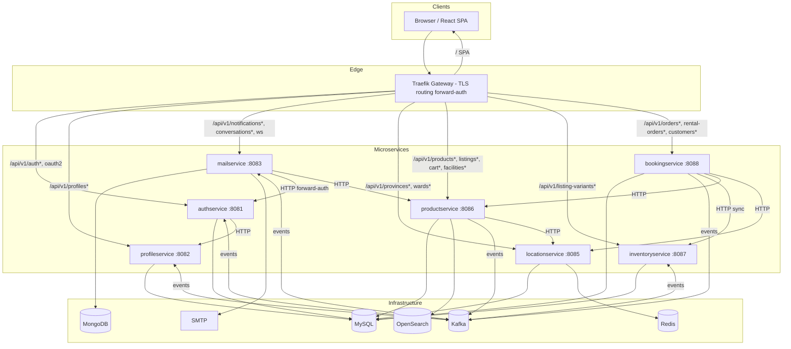
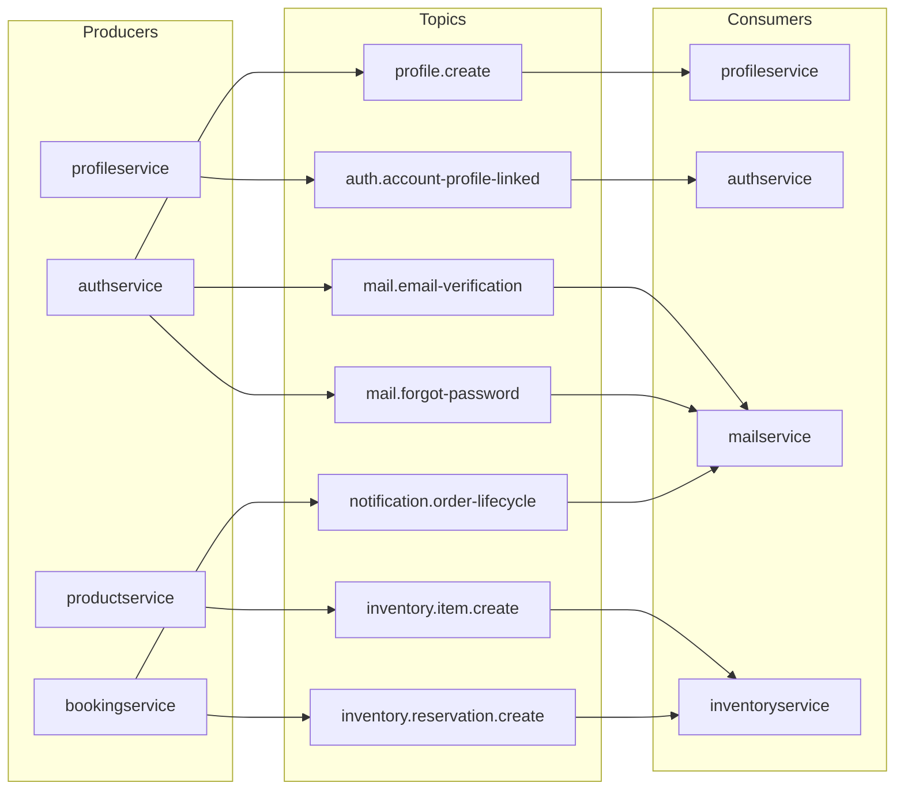
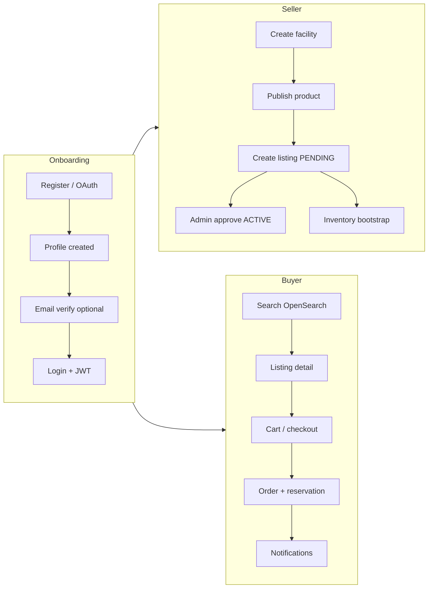

# System architecture

All public traffic enters through **Traefik** (`:80` / `:443`). The SPA is served at `/`; REST APIs live under `/api/v1/*`. Protected routes use **forward-auth** to `authservice`, which validates the JWT and injects `X-Profile-Id`, `X-User-Email`, and `role`.

## System architecture



### Diagram notes

| Layer | Role |
|-------|------|
| **Traefik** | Single entry point; path-based routing; JWT forward-auth for protected APIs; dev mode proxies `/` to Vite on `:5173`. |
| **authservice** | Accounts, JWT, Google OAuth, email verification; publishes profile/email events; consumes profile-link events. |
| **profileservice** | User profiles; creates profile from Kafka after signup. |
| **productservice** | Catalog, facilities, listings, cart, OpenSearch search; publishes inventory bootstrap events. |
| **inventoryservice** | Stock and time-slot reservations; consumed by bookingservice over HTTP during checkout. |
| **bookingservice** | Buy/rent orders, customers, checkout orchestration; order notifications via Kafka. |
| **mailservice** | Email (Kafka), in-app notifications, buyer-seller chat, WebSocket push. |
| **locationservice** | VN provinces/wards + GIS validation; Redis-cached reads. |
| **MySQL** | Primary store for auth, profile, product, inventory, booking, location (separate DBs per service). |
| **MongoDB** | Conversations, messages, notifications (mailservice only). |
| **OpenSearch** | Listing search index (productservice); managed externally in production. |
| **Kafka** | Async coupling: profile provisioning, email, inventory bootstrap, reservations (alt path), order notifications. |

## Service catalog

Each service has its own **README** with data models (ER diagrams) and **sequence diagrams** for main flows.

| Service | Port | Storage | Responsibility | README |
|---------|------|---------|----------------|--------|
| **authservice** | 8081 | MySQL | Register/login (email + Google), JWT, OAuth2, admin accounts | [authservice/README.md](../authservice/README.md) |
| **profileservice** | 8082 | MySQL | Profiles, Kafka-driven provisioning after signup | [profileservice/README.md](../profileservice/README.md) |
| **mailservice** | 8083 | MongoDB | Email, notifications, messaging, WebSocket | [mailservice/README.md](../mailservice/README.md) |
| **locationservice** | 8085 | MySQL + Redis | Provinces, wards, GIS geocoding and validation | [locationservice/README.md](../locationservice/README.md) |
| **productservice** | 8086 | MySQL + OpenSearch | Products, listings, facilities, cart, search | [productservice/README.md](../productservice/README.md) |
| **inventoryservice** | 8087 | MySQL | BUY/RENT stock, reservations | [inventoryservice/README.md](../inventoryservice/README.md) |
| **bookingservice** | 8088 | MySQL | Buy/rent orders, checkout, facility order metrics | [bookingservice/README.md](../bookingservice/README.md) |

### Shared libraries (no runtime API)

| Module | Purpose | README |
|--------|---------|--------|
| **commonservice** | `ApiResponse`, `ErrorCode`, shared events/DTOs | [commonservice/README.md](../commonservice/README.md) |
| **commonjpa** | `BaseEntity`, soft-delete helpers | [commonjpa/README.md](../commonjpa/README.md) |

### Frontend

| Path | Stack | Notes |
|------|-------|-------|
| `ui/artifacts/second-life/` | Vite + React + TypeScript | Marketplace UI, seller hub (`/manage`), admin (`/admin`) |

## API gateway routing

Traefik rules (see [`traefik/dynamic.yml`](../traefik/dynamic.yml)):

| Path prefix | Service | Auth |
|-------------|---------|------|
| `/api/v1/auth`, `/api/v1/oauth2`, `/api/v1/login/oauth2` | authservice | Public (except admin) |
| `/api/v1/profiles` | profileservice | JWT forward-auth |
| `/api/v1/notifications`, `/api/v1/conversations`, `/api/v1/ws/notifications` | mailservice | JWT (WS: cookie or header) |
| `/api/v1/provinces`, `/api/v1/wards` | locationservice | Public |
| `/api/v1/facilities`, `categories`, `products`, `listings`, `cart`, `ai` | productservice | JWT forward-auth |
| `/api/v1/listing-variants` | inventoryservice | JWT forward-auth |
| `/api/v1/customers`, `/api/v1/orders`, `/api/v1/rental-orders` | bookingservice | JWT forward-auth |
| `/` (not `/api`) | SPA (static prod / Vite dev) | - |

Internal-only HTTP (Docker network, not exposed via Traefik): e.g. `POST /reservations/buy`, `POST /facilities/{id}/record-order` — called service-to-service.

## Event bus (Kafka)



| Topic | Producer | Consumer | Purpose |
|-------|----------|----------|---------|
| `profile.create` | authservice | profileservice | Create profile after register/OAuth |
| `auth.account-profile-linked` | profileservice | authservice | Set `account.profile_id` |
| `mail.email-verification` | authservice | mailservice | Verification email |
| `mail.forgot-password` | authservice | mailservice | Password reset email |
| `inventory.item.create` | productservice | inventoryservice | Stock rows for new listing variants |
| `inventory.reservation.create` | bookingservice | inventoryservice | Async reservation (checkout uses sync HTTP) |
| `notification.order-lifecycle` | bookingservice | mailservice | In-app + email order updates |

## End-to-end flows

High-level journeys with detailed **sequence diagrams** in service READMEs:



| Journey | Diagram location |
|---------|------------------|
| Email register / login / verify | [authservice/README.md](../authservice/README.md) |
| Google OAuth login and register | [authservice/README.md](../authservice/README.md) |
| Profile provisioning (Kafka) | [profileservice/README.md](../profileservice/README.md) |
| Create listing, OpenSearch, inventory | [productservice/README.md](../productservice/README.md) |
| Admin approve listing | [productservice/README.md](../productservice/README.md) |
| Public search | [productservice/README.md](../productservice/README.md) |
| Add to cart | [productservice/README.md](../productservice/README.md) |
| BUY / RENT order + facility order count | [bookingservice/README.md](../bookingservice/README.md) |
| BUY / RENT reservations | [inventoryservice/README.md](../inventoryservice/README.md) |
| Messaging + WebSocket (facility chat + admin support) | [mailservice/README.md](../mailservice/README.md) |
| Order notifications | [mailservice/README.md](../mailservice/README.md) |
| Province/ward + GIS validation | [locationservice/README.md](../locationservice/README.md) |

Additional draw.io diagrams: [`diagrams/`](../diagrams/README.md).

## Repository layout

```
Second_Life/
├── ui/                          # pnpm monorepo; SPA in artifacts/second-life/
├── authservice/                 # Auth + OAuth
├── profileservice/
├── mailservice/
├── locationservice/
├── productservice/
├── inventoryservice/
├── bookingservice/
├── commonservice/               # Shared Java library
├── commonjpa/                   # Shared JPA base entities
├── documents/                   # System docs (this folder)
├── traefik/                     # Gateway static + dynamic config
├── scripts/                     # Data crawl, seed, CI helpers
├── docker-compose.yml           # Dev stack (Kafka, Redis, services, Traefik)
├── docker-compose.prod.yml      # Production overlay
├── DEPLOY-PRODUCTION.md         # VPS deploy guide
└── .env.example                 # Local env template
```
