# BÁO CÁO ĐỒ ÁN

## Xây dựng hệ thống gợi ý giá điện thoại cũ bằng học máy trên nền tảng Second Life

**Đề tài:** Ứng dụng học máy trong định giá sản phẩm thị trường đồ cũ  
**Dự án:** Second Life Marketplace  
**Dữ liệu huấn luyện:** Tin đăng điện thoại từ Chợ Tốt  
**Triển khai:** Microservice Python (Flask) tích hợp Spring Boot

---

## Mục lục

- [Chương 1. Cơ sở lý thuyết](#chương-1-cơ-sở-lý-thuyết)
- [Chương 2. Phân tích và thiết kế hệ thống](#chương-2-phân-tích-và-thiết-kế-hệ-thống)
- [Chương 3. Triển khai hệ thống và kết quả thực nghiệm](#chương-3-triển-khai-hệ-thống-và-kết-quả-thực-nghiệm)
- [Kết luận](#kết-luận)
- [Danh mục hình ảnh](#danh-mục-hình-ảnh)

---

# Chương 1. Cơ sở lý thuyết

## 1.1. Đặt vấn đề

Thị trường mua bán đồ cũ tại Việt Nam đang phát triển mạnh thông qua các nền tảng trực tuyến như Chợ Tốt, Facebook Marketplace và các sàn thương mại chuyên biệt. Trong bối cảnh đó, người bán thường gặp khó khăn trong việc xác định mức giá phù hợp: định giá cao hơn thị trường khiến sản phẩm khó tiêu thụ, trong khi định giá thấp gây thiệt hại về lợi ích kinh tế.

Đối với nhóm sản phẩm **điện thoại di động đã qua sử dụng**, giá bán phụ thuộc vào nhiều yếu tố như hãng sản xuất, model, cấu hình, tình trạng máy, tuổi đời sản phẩm, khu vực giao dịch và cả nội dung mô tả trong tin đăng. Do đó, bài toán định giá có thể được mô hình hóa dưới dạng **bài toán hồi quy**, trong đó mục tiêu là dự đoán giá bán (đơn vị VND) từ tập hợp các đặc trưng mô tả sản phẩm.

Trong khuôn khổ đồ án, hệ thống gợi ý giá được xây dựng nhằm hỗ trợ người bán trên nền tảng **Second Life** khi tạo tin đăng bán điện thoại, góp phần nâng cao trải nghiệm người dùng và tăng tính minh bạch của thị trường.

## 1.2. Cơ sở lý thuyết về học máy cho bài toán định giá

### 1.2.1. Mô hình hồi quy và biến đổi biến mục tiêu

Trong bài toán dự đoán giá, biến mục tiêu thường có phân phối **lệch phải**: phần lớn sản phẩm tập trung ở phân khúc giá thấp và trung bình, trong khi một số ít thuộc phân khúc cao cấp có giá trị lớn. Để giảm ảnh hưởng của phân phối lệch đến quá trình huấn luyện, hệ thống áp dụng phép biến đổi logarit:

$$\text{log\_price} = \log(1 + \text{price\_vnd})$$

Sau khi mô hình dự đoán giá trị logarit, kết quả được chuyển ngược về đơn vị VND bằng hàm `expm1`. Phương pháp này giúp phân phối mục tiêu tiệm cận chuẩn hơn, từ đó cải thiện khả năng học của mô hình trên dải giá từ 500.000 đến 80.000.000 VND.

### 1.2.2. Thuật toán Gradient Boosting

Trong nghiên cứu này, hai thuật toán học máy dạng cây được xem xét:

- **XGBoost (Extreme Gradient Boosting):** xây dựng tập hợp các cây quyết định theo hướng bổ sung, trong đó mỗi cây sau hiệu chỉnh sai số của các cây trước. Thuật toán phù hợp với dữ liệu dạng bảng, có khả năng xử lý tốt giá trị thiếu và tương tác phi tuyến giữa các đặc trưng.
- **LightGBM (Light Gradient Boosting Machine):** cùng nguyên lý với XGBoost nhưng tối ưu hóa tốc độ huấn luyện và mức sử dụng bộ nhớ, đặc biệt hiệu quả trên tập dữ liệu lớn.

Kết quả thực nghiệm cho thấy XGBoost đạt hiệu năng tốt hơn trên tập kiểm thử, vì vậy được lựa chọn làm mô hình chính thức của hệ thống.

### 1.2.3. Mã hóa biến phân loại bằng Target Encoding

Biến **model** và **color** có số lượng giá trị rời rạc lớn, đóng vai trò quan trọng trong việc xác định giá. Phương pháp **Target Encoding** mã hóa các biến này bằng giá trị trung bình của biến mục tiêu tương ứng.

Tuy nhiên, nếu tính toán giá trị mã hóa trên toàn bộ tập huấn luyện trước khi chia cross-validation, thông tin của biến mục tiêu sẽ bị rò rỉ vào tập kiểm định, dẫn đến đánh giá lạc quan không phản ánh đúng khả năng tổng quát hóa. Để khắc phục, hệ thống sử dụng `TargetEncoder` của scikit-learn với cơ chế **cross-fit 5-fold** được nhúng trực tiếp trong pipeline huấn luyện, bảo đảm mỗi fold chỉ học từ dữ liệu huấn luyện của chính fold đó.

### 1.2.4. Đánh giá mô hình và tối ưu siêu tham số

Quy trình đánh giá mô hình được thực hiện theo các bước sau:

1. **Chia dữ liệu:** 80% huấn luyện, 20% kiểm thử, với `random_state` cố định để đảm bảo tái lập kết quả.
2. **Cross-validation 5-fold:** đánh giá độ ổn định của mô hình trên tập huấn luyện.
3. **Tối ưu siêu tham số bằng Optuna:** sử dụng bộ lấy mẫu TPE (Tree-structured Parzen Estimator) với 50 lần thử nghiệm cho mỗi thuật toán.
4. **Đo lường bằng các chỉ số:**
   - **R² (hệ số xác định):** mức độ giải thích phương sai của mô hình;
   - **MAE (Mean Absolute Error):** sai số tuyệt đối trung bình, đơn vị VND;
   - **MAPE (Mean Absolute Percentage Error):** sai số phần trăm trung bình;
   - **Chênh lệch CV/Test:** phản ánh mức độ overfitting.

## 1.3. Kỹ thuật trích chọn đặc trưng

Hệ thống sử dụng 26 đặc trưng, được chia thành ba nhóm chính:

**Nhóm đặc trưng cấu trúc:** RAM, dung lượng bộ nhớ, kích thước màn hình, điểm tình trạng máy, tuổi đời sản phẩm, thế hệ chip, nguồn gốc, bảo hành, khu vực, trạng thái khóa SIM, số lượng ảnh và video đính kèm.

**Nhóm đặc trưng văn bản:** trích xuất từ tiêu đề và mô tả tin đăng, bao gồm điểm từ khóa chất lượng, điểm từ khóa lỗi và phần trăm pin (nếu có).

**Nhóm đặc trưng tổng hợp:** `spec_score` (tổ hợp RAM và bộ nhớ), `depreciation_score` (tổ hợp tuổi máy và tình trạng), `chip_x_age` (tương tác giữa thế hệ chip và tuổi máy).

## 1.4. Kiến trúc tích hợp trong hệ sinh thái microservice

Hệ thống gợi ý giá được triển khai theo mô hình microservice, tách biệt giữa tầng huấn luyện mô hình và tầng phục vụ suy luận:

- **Giao diện người dùng (React):** người bán nhập thông tin sản phẩm tại Seller Hub.
- **Product Service (Spring Boot):** tiếp nhận yêu cầu, chuẩn hóa dữ liệu đầu vào và chuyển tiếp đến dịch vụ AI.
- **AI Service (Flask):** nạp mô hình đã huấn luyện, thực hiện suy luận và trả về kết quả định giá.
- **API Gateway (Traefik):** định tuyến, xác thực và cân bằng tải.

Kiến trúc này cho phép cập nhật mô hình độc lập mà không ảnh hưởng đến các dịch vụ nghiệp vụ khác.

## 1.5. Công nghệ sử dụng

| Tầng | Công nghệ |
|------|-----------|
| Huấn luyện mô hình | Python, scikit-learn, XGBoost, LightGBM, Optuna, SHAP |
| Phục vụ suy luận | Flask, Gunicorn, joblib |
| Tích hợp backend | Java 21, Spring Boot 3.5 |
| Triển khai | Docker Compose |
| Dữ liệu | CSV tin đăng Chợ Tốt |

---

# Chương 2. Phân tích và thiết kế hệ thống

## 2.1. Phân tích yêu cầu

### 2.1.1. Yêu cầu chức năng

Hệ thống cần đáp ứng các yêu cầu chức năng sau:

1. Nhận thông tin sản phẩm điện thoại từ người bán và trả về **giá gợi ý** bằng VND.
2. Cung cấp **khoảng giá tối thiểu và tối đa** để hỗ trợ thương lượng.
3. Đánh giá **mức độ tin cậy** của kết quả (HIGH, MEDIUM, LOW) dựa trên mức độ đầy đủ thông tin đầu vào.
4. Trả về **lời giải thích ngắn** bằng tiếng Việt về cơ sở định giá.
5. Chỉ hỗ trợ định giá cho tin đăng **bán** (`listingType = BUY`) thuộc danh mục **điện thoại** (`sub-phone`).

### 2.1.2. Yêu cầu phi chức năng

- Thời gian phản hồi suy luận dưới 1 giây.
- Mô hình được nạp sẵn khi khởi động dịch vụ; endpoint kiểm tra sức khỏe báo trạng thái sẵn sàng.
- Tách biệt quy trình huấn luyện (Google Colab) và triển khai (Docker) thông qua cơ chế export artifacts.
- Logic trích chọn đặc trưng đồng nhất giữa notebook huấn luyện và mã nguồn phục vụ.

---

## 2.2. Phân tích dữ liệu huấn luyện

### 2.2.1. Nguồn và đặc điểm tập dữ liệu

Dữ liệu huấn luyện được thu thập từ tin đăng điện thoại và máy tính bảng trên nền tảng Chợ Tốt, lưu trữ trong tệp `phone_tablet_dataset_raw.csv`. Tập dữ liệu thô gồm **12.904 bản ghi** với **45 thuộc tính**, bao gồm giá bán, hãng sản xuất, model, cấu hình phần cứng, tình trạng sản phẩm, khu vực, tiêu đề, mô tả, số ảnh đính kèm và các thông tin phụ trợ khác.

Phạm vi giá được giới hạn trong khoảng **500.000 – 80.000.000 VND** nhằm loại bỏ các giá trị bất thường do nhập liệu sai hoặc tin đăng giá mồi.

### 2.2.2. Quy trình tiền xử lý dữ liệu

Quy trình làm sạch dữ liệu được thực hiện theo trình tự sau:

| Bước | Mô tả | Số bản ghi còn lại |
|------|-------|-------------------|
| 1 | Dữ liệu thô | 12.904 |
| 2 | Lọc theo ngưỡng giá hợp lệ | 12.736 |
| 3 | Lọc danh mục điện thoại | 12.736 |
| 4 | Chuẩn hóa thuộc tính và trích tín hiệu văn bản | 12.736 |
| 5 | Loại bỏ bản ghi thiếu thuộc tính lõi | 12.736 |
| 6 | Lọc ngoại lai toàn cục (percentile 1%–99%) | 12.507 |
| 7 | Lọc ngoại lai theo từng model (phương pháp MAD) | **12.391** |
| 8 | Chia tập huấn luyện / kiểm thử (80/20) | 9.912 / 2.479 |

Các bước xử lý chi tiết gồm: chuẩn hóa dung lượng bộ nhớ và RAM theo các mức phổ biến trên thị trường; nhóm khu vực thành HCM, Hà Nội, Đà Nẵng và Khác; ánh xạ tình trạng máy sang thang điểm số; và áp dụng bộ lọc MAD (Median Absolute Deviation) để loại các tin có giá lệch quá 4 lần độ lệch tuyệt đối trung vị so với giá trung vị của cùng model.

### 2.2.3. Phân tích phân phối giá

Kết quả khảo sát cho thấy phân phối giá bán có đặc điểm **lệch phải rõ rệt**: đa số tin đăng tập trung ở phân khúc bình dân và tầm trung. Sau khi áp dụng biến đổi logarit, phân phối tiệm cận dạng chuẩn hơn, phù hợp cho mô hình hồi quy.

Theo phân loại phân khúc thị trường:

| Phân khúc | Ngưỡng giá | Đặc điểm |
|-----------|------------|----------|
| Bình dân | Dưới 5 triệu VND | Điện thoại giá rẻ, máy đời cũ |
| Tầm trung | 5 – 15 triệu VND | Phổ biến nhất, đa dạng model |
| Cao cấp | Trên 15 triệu VND | Flagship, máy tình trạng tốt |

Hình 2.1 trình bày tổng quan về phân phối giá, cơ cấu phân khúc, số lượng tin theo hãng và mức độ thiếu dữ liệu của các thuộc tính quan trọng.

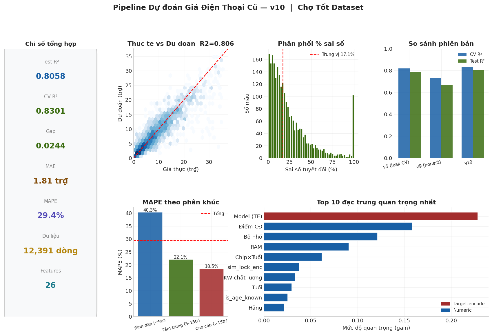

*Hình 2.1. Tổng quan tập dữ liệu: (a) phân phối giá, (b) phân phối log-price, (c) tỷ lệ phân khúc, (d) số lượng tin theo hãng, (e) tỷ lệ giá trị thiếu.*

### 2.2.4. Phân tích theo hãng sản xuất, tình trạng và khu vực

Về mặt hãng sản xuất, Apple, Samsung, Xiaomi, Oppo, Vivo và Realme chiếm phần lớn số lượng tin đăng. Giá trung vị theo hãng cho thấy Apple đứng đầu, tiếp theo là các dòng flagship của Samsung, trong khi các hãng Trung Quốc tập trung ở phân khúc giá thấp hơn. Độ phân tán giá trong cùng một hãng khá lớn, phản ánh sự đa dạng về model và tình trạng sản phẩm.

Về tình trạng máy, nhóm Like New có giá trung vị cao nhất, nhóm Good chiếm tỷ lệ lớn nhất với dải giá rộng, còn nhóm Fair có giá thấp hơn đáng kể.

Về khu vực địa lý, TP. Hồ Chí Minh và Hà Nội ghi nhận giá trung vị cao hơn Đà Nẵng và các khu vực khác ở mọi phân khúc, phù hợp với đặc điểm thị trường điện thoại cũ tại hai thành phố lớn.

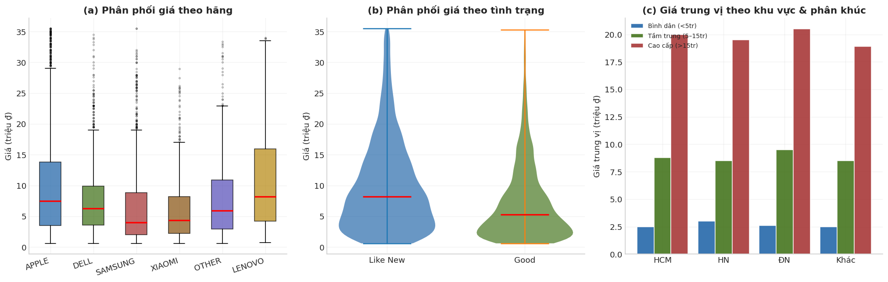

*Hình 2.2. Phân tích giá bán theo (a) hãng sản xuất, (b) tình trạng máy và (c) khu vực địa lý kết hợp phân khúc giá.*

### 2.2.5. Phân tích giá trị thiếu

Một số thuộc tính có tỷ lệ thiếu đáng kể, đòi hỏi chiến lược xử lý phù hợp:

| Thuộc tính | Mức thiếu | Phương án xử lý |
|------------|-----------|-----------------|
| Processor | Cao (>50%) | Suy luận thế hệ chip từ tên model, bổ sung bằng median theo hãng |
| Năm sản xuất | Trung bình | Trích từ văn bản tin đăng, thay thế bằng tuổi trung vị |
| Kích thước màn hình | Trung bình | Điền bằng giá trị trung vị toàn tập |
| RAM, bộ nhớ | Thấp–trung bình | Điền bằng giá trị trung vị |
| Màu sắc | Thấp | Gán nhãn đặc biệt `__NA__` |

Tỷ lệ khớp thế hệ chip trực tiếp từ tên processor/model đạt **30,3%**; phần còn lại được bổ sung bằng giá trị trung vị theo hãng, không sử dụng thông tin giá nhằm tránh rò rỉ dữ liệu.

### 2.2.6. Phân tích tín hiệu văn bản

Từ tiêu đề và mô tả tin đăng, hệ thống trích xuất ba nhóm tín hiệu văn bản. Thống kê trên tập dữ liệu sau bước làm sạch ban đầu cho thấy:

- **58,3%** tin đăng chứa ít nhất một từ khóa chất lượng (zin, fullbox, bảo hành…).
- **25,5%** tin đăng chứa từ khóa mô tả lỗi hoặc hư hỏng (trầy, nứt, chai pin…).
- **11,1%** tin đăng cung cấp thông tin phần trăm pin.
- **10,7%** tin đăng xác định được năm sản xuất; tuổi máy trung vị trong nhóm này là **4,0 năm**.

Phân tích cho thấy giá trung vị tăng theo số lượng từ khóa chất lượng và giảm theo số lượng từ khóa lỗi. Đối với thông tin pin, nhóm pin từ 95–100% có giá trung vị cao hơn rõ rệt so với nhóm pin 50–79%.

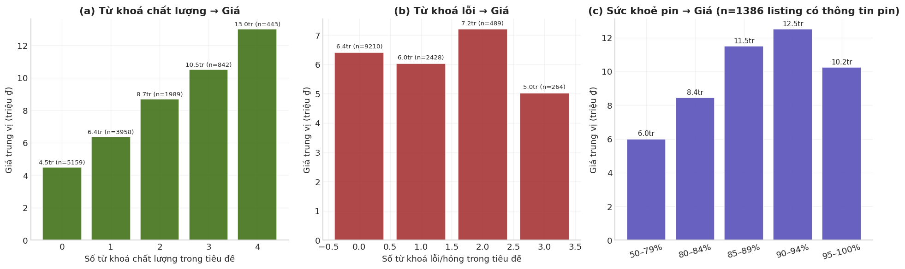

*Hình 2.3. Mối quan hệ giữa tín hiệu văn bản và giá bán: (a) từ khóa chất lượng, (b) từ khóa lỗi, (c) sức khỏe pin.*

### 2.2.7. Phân tích theo thông số kỹ thuật

Quan hệ giữa thông số kỹ thuật và giá bán thể hiện các xu hướng sau:

- **RAM:** giá tăng dần từ 2 GB đến 8 GB trở lên, sau đó ổn định ở phân khúc cao cấp.
- **Dung lượng bộ nhớ:** giá tăng mạnh từ 64 GB lên 256 GB và 1 TB.
- **Thế hệ chip:** thế hệ 4–5 (chip mới) có giá cao hơn thế hệ 1–2.
- **Tuổi máy:** giá giảm đơn điệu theo thời gian sử dụng.

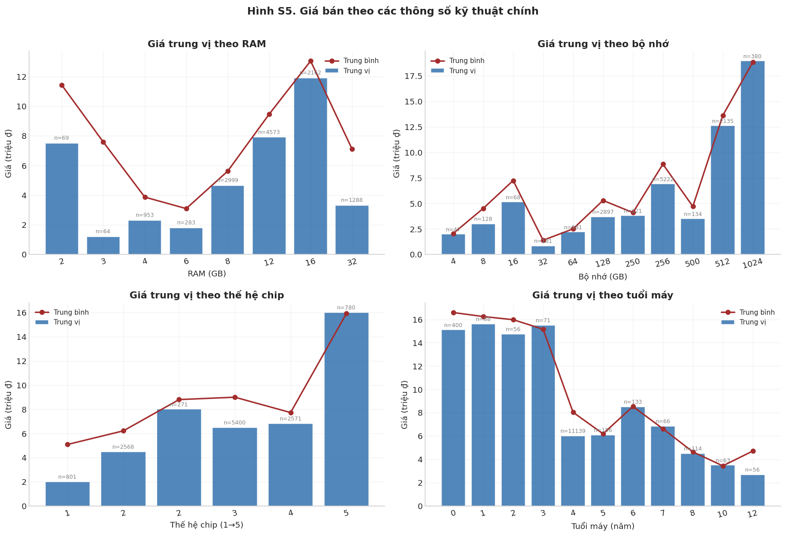

*Hình 2.4. Giá trung vị và trung bình theo (a) RAM, (b) dung lượng bộ nhớ, (c) thế hệ chip và (d) tuổi máy.*

### 2.2.8. Ma trận tương quan

Ma trận tương quan Pearson (Hình 2.5) cho thấy các mối liên hệ đáng chú ý với giá bán:

- Tương quan **dương mạnh:** dung lượng bộ nhớ, thế hệ chip, điểm tình trạng, điểm cấu hình, từ khóa chất lượng.
- Tương quan **âm:** tuổi máy, điểm khấu hao, từ khóa lỗi.

Biến RAM và dung lượng bộ nhớ có tương quan cao với nhau; mô hình dạng cây (XGBoost) có khả năng xử lý đa cộng tuyến tốt hơn so với mô hình hồi quy tuyến tính.

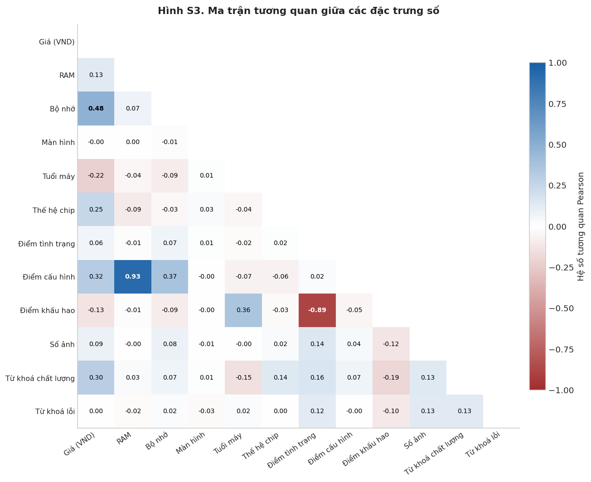

*Hình 2.5. Ma trận tương quan Pearson giữa các đặc trưng số và biến mục tiêu giá bán.*

### 2.2.9. Kết luận giai đoạn phân tích dữ liệu

Qua quá trình khảo sát và phân tích, có thể rút ra các nhận định sau:

1. Tập dữ liệu sau làm sạch gồm **12.391 bản ghi**, đủ quy mô và đa dạng cho bài toán định giá điện thoại cũ.
2. Dữ liệu thực tế mang tính **nhiễu và không đồng nhất**, đòi hỏi quy trình tiền xử lý và lọc ngoại lai chặt chẽ.
3. Tín hiệu văn bản và metadata tin đăng có **giá trị dự đoán** đáng kể, cần được đưa vào mô hình.
4. Biến đổi logarit trên biến mục tiêu là **cần thiết** do đặc điểm phân phối giá.
5. Biến model là yếu tố quan trọng nhất, cần được mã hóa theo phương pháp **không gây rò rỉ dữ liệu**.

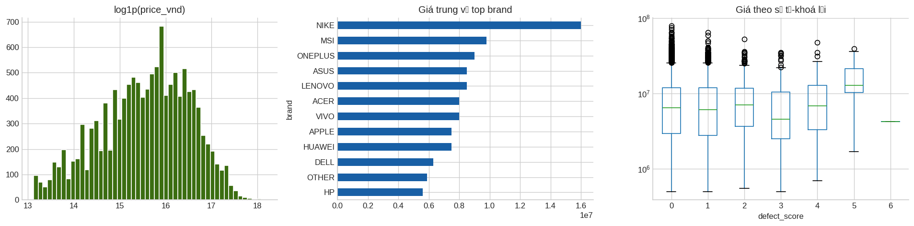

*Hình 2.6. Khảo sát sơ bộ: phân phối log-price, giá trung vị theo hãng và mối liên hệ giữa từ khóa lỗi với giá bán.*

---

## 2.3. Thiết kế pipeline học máy

### 2.3.1. Kiến trúc pipeline

Pipeline huấn luyện được thiết kế theo luồng xử lý tuần tự: thu thập dữ liệu → tiền xử lý → trích chọn đặc trưng → mã hóa biến phân loại → huấn luyện mô hình → tối ưu siêu tham số → xuất artifacts → triển khai suy luận.

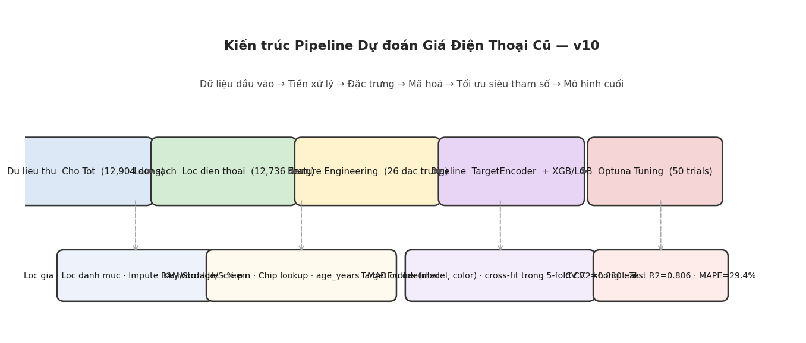

*Hình 2.7. Sơ đồ kiến trúc pipeline dự đoán giá điện thoại cũ: từ dữ liệu thô đến mô hình cuối cùng.*

### 2.3.2. Bộ đặc trưng đầu vào

Hệ thống sử dụng **26 đặc trưng**, trong đó hai biến `model` và `color` được mã hóa bằng Target Encoding, còn 24 đặc trưng còn lại bao gồm các thuộc tính số, thuộc tính đã mã hóa nhãn và các đặc trưng tổng hợp như đã trình bày ở mục 1.3.

### 2.3.3. Cấu trúc pipeline scikit-learn

Pipeline huấn luyện được xây dựng bằng scikit-learn, kết hợp bước tiền xử lý và mô hình hồi quy trong một luồng thống nhất. Bước tiền xử lý sử dụng `ColumnTransformer` với `TargetEncoder` (cross-fit 5-fold) cho biến model và color; các đặc trưng còn lại được giữ nguyên dạng số. Mô hình cuối cùng là `XGBRegressor` với bộ siêu tham số tối ưu từ Optuna.

---

## 2.4. Thiết kế tích hợp hệ thống Second Life

### 2.4.1. Kiến trúc tổng thể

Hệ thống Second Life vận hành theo kiến trúc microservice. Chức năng gợi ý giá được tích hợp vào Product Service và giao tiếp với AI Service thông qua REST API nội bộ.

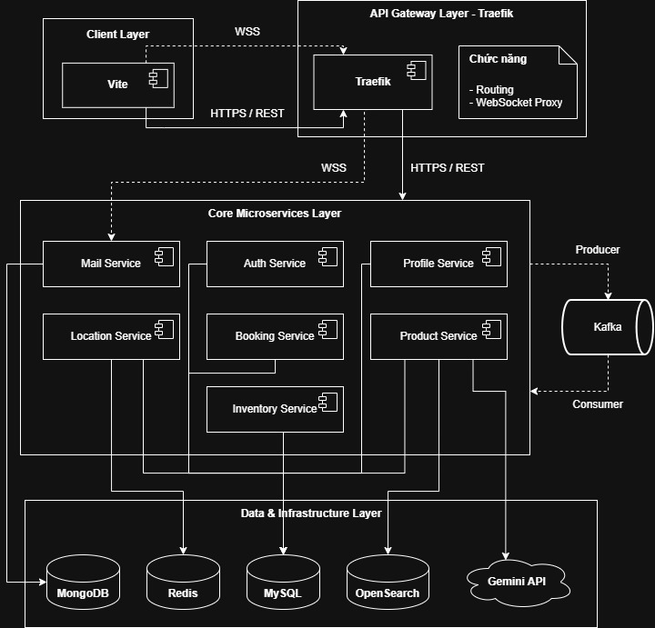

*Hình 2.8. Kiến trúc tổng thể hệ thống Second Life với các microservice và API Gateway.*

### 2.4.2. Luồng xử lý gợi ý giá

Khi người bán yêu cầu gợi ý giá tại Seller Hub, luồng xử lý diễn ra như sau:

1. Giao diện gửi yêu cầu đến Product Service qua endpoint `POST /ai/suggest-price`.
2. Product Service kiểm tra danh mục sản phẩm (điện thoại) và loại tin đăng (bán).
3. Lớp `PhonePricingRequestMapper` chuyển đổi dữ liệu từ định dạng nghiệp vụ sang payload phù hợp với mô hình.
4. `PhonePricingClient` gọi AI Service tại endpoint `POST /api/v1/ai/suggest-price/phone`.
5. AI Service trích chọn đặc trưng, thực hiện suy luận và trả về giá gợi ý cùng khoảng giá và mức tin cậy.

### 2.4.3. Thiết kế giao diện lập trình ứng dụng

**Đầu vào** gồm: tên sản phẩm, tiêu đề và mô tả tin đăng, danh sách thuộc tính (hãng, dung lượng, tình trạng…), năm sản xuất, khu vực và số lượng ảnh đính kèm.

**Đầu ra** gồm: giá gợi ý (`suggestedPriceVnd`), giá tối thiểu và tối đa, mức tin cậy, lời giải thích ngắn bằng tiếng Việt.

### 2.4.4. Cơ chế đánh giá mức tin cậy

| Mức tin cậy | Điều kiện | Biên độ khoảng giá |
|-------------|-----------|-------------------|
| HIGH | Đầy đủ thông số, model và tuổi máy | ±18% |
| MEDIUM | Có thông số và model, hoặc có mô tả văn bản | ±22% |
| LOW | Thiếu thông tin quan trọng | ±28% |

---

# Chương 3. Triển khai hệ thống và kết quả thực nghiệm

## 3.1. Triển khai quy trình huấn luyện

### 3.1.1. Môi trường thực nghiệm

Quá trình huấn luyện được thực hiện trên Google Colab với các thư viện scikit-learn 1.6.1, XGBoost, LightGBM và Optuna. Các tham số cố định: `RANDOM_SEED = 42`, tỷ lệ chia tập kiểm thử 20%, số lần thử nghiệm Optuna 50.

### 3.1.2. Tối ưu siêu tham số

Thuật toán Optuna với bộ lấy mẫu TPE được sử dụng để tìm kiếm bộ siêu tham số tối ưu cho cả XGBoost và LightGBM. Tiêu chí tối ưu là hệ số xác định R² trung bình trên 5-fold cross-validation.

Kết quả tối ưu đạt CV R² = **0,8301** cho XGBoost và **0,8302** cho LightGBM. Hình 3.1 minh họa quá trình hội tụ của các lần thử nghiệm.

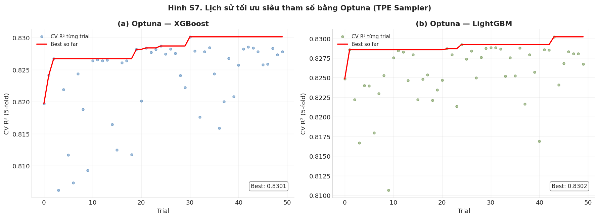

*Hình 3.1. Lịch sử tối ưu siêu tham số bằng Optuna: CV R² qua từng lần thử nghiệm của XGBoost và LightGBM.*

### 3.1.3. Kết quả đánh giá mô hình

Bảng 3.1 trình bày kết quả so sánh hai thuật toán trên tập kiểm thử:

**Bảng 3.1. Kết quả đánh giá mô hình trên tập kiểm thử**

| Mô hình | CV R² (TB ± ĐLC) | Test R² | Chênh lệch CV/Test | MAE (VND) | MAPE (%) |
|---------|------------------|---------|-------------------|-----------|----------|
| XGBoost | 0,8301 ± 0,0135 | **0,8058** | 0,0244 | **1.810.294** | **29,4** |
| LightGBM | 0,8302 ± 0,0125 | 0,8039 | 0,0263 | 1.822.059 | 30,1 |

Mô hình **XGBoost** được lựa chọn triển khai chính thức với Test R² = **0,8058**, tức mô hình giải thích khoảng **80,6%** phương sai giá bán trên tập kiểm thử. Chênh lệch giữa CV R² và Test R² chỉ **0,0244**, cho thấy mô hình không bị overfitting đáng kể.

Hình 3.2 thể hiện kết quả cross-validation chi tiết theo từng fold.

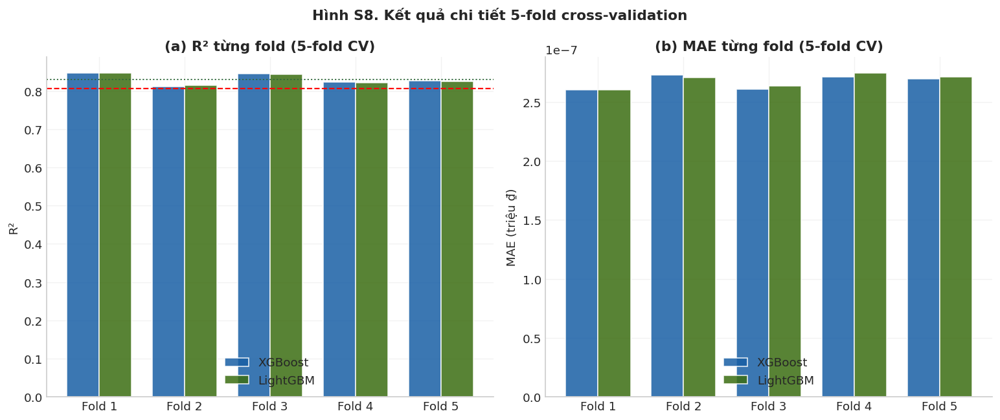

*Hình 3.2. Hệ số R² và MAE trên từng fold trong quá trình đánh giá 5-fold cross-validation.*

### 3.1.4. Phân tích chất lượng dự đoán

**Mối tương quan thực tế – dự đoán:** Hình 3.3 cho thấy điểm dự đoán phân bố sát đường chéo lý tưởng, đặc biệt ở phân khúc tầm trung.

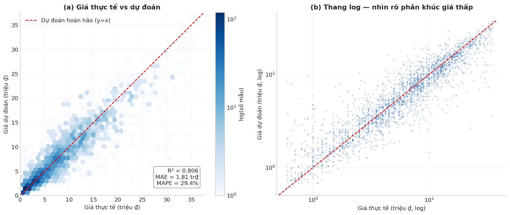

*Hình 3.3. Biểu đồ phân tán giữa giá thực tế và giá dự đoán trên tập kiểm thử.*

**Phân phối sai số:** Sai số tuyệt đối phần trăm (APE) có trung vị khoảng 20–25%, với phần lớn dự đoán nằm trong ngưỡng chấp nhận được cho thị trường đồ cũ (Hình 3.4).

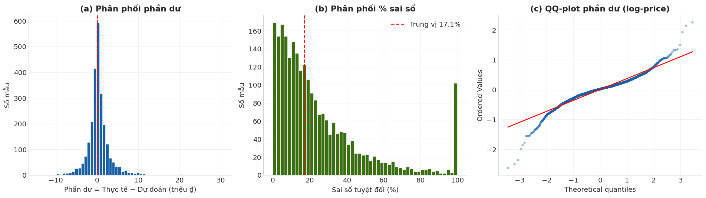

*Hình 3.4. Phân phối sai số tuyệt đối phần trăm (APE) trên tập kiểm thử.*

**Sai số theo nhóm:** Phân khúc tầm trung cho kết quả ổn định nhất; phân khúc bình dân có sai số tương đối cao hơn do biến động giá lớn ở phân khúc giá thấp (Hình 3.5).

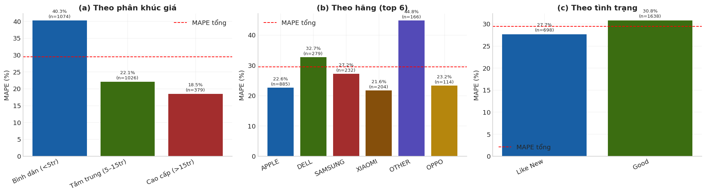

*Hình 3.5. Sai số dự đoán theo phân khúc giá và theo hãng sản xuất.*

**Mức độ quan trọng đặc trưng:** Các đặc trưng đóng góp nhiều nhất gồm model (qua Target Encoding), dung lượng bộ nhớ, điểm tình trạng, tuổi máy, từ khóa chất lượng/lỗi và thế hệ chip (Hình 3.6).

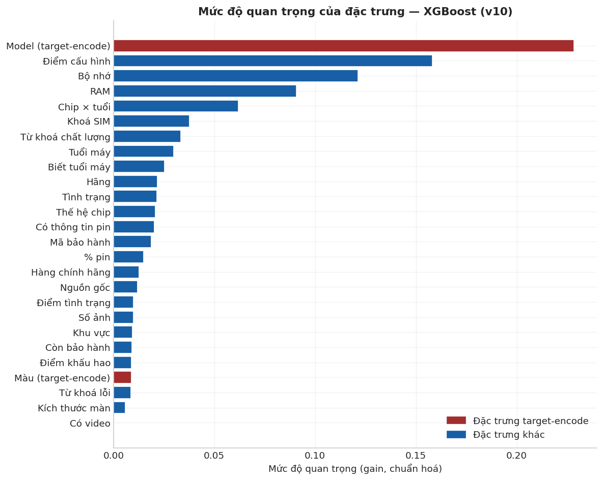

*Hình 3.6. Mức độ quan trọng của 15 đặc trưng hàng đầu theo mô hình XGBoost.*

**Đường cong học:** Hình 3.7 cho thấy R² trên tập kiểm định tiến dần đến ổn định khi tăng kích thước tập huấn luyện, xác nhận tập dữ liệu hiện tại đủ để mô hình học hiệu quả.

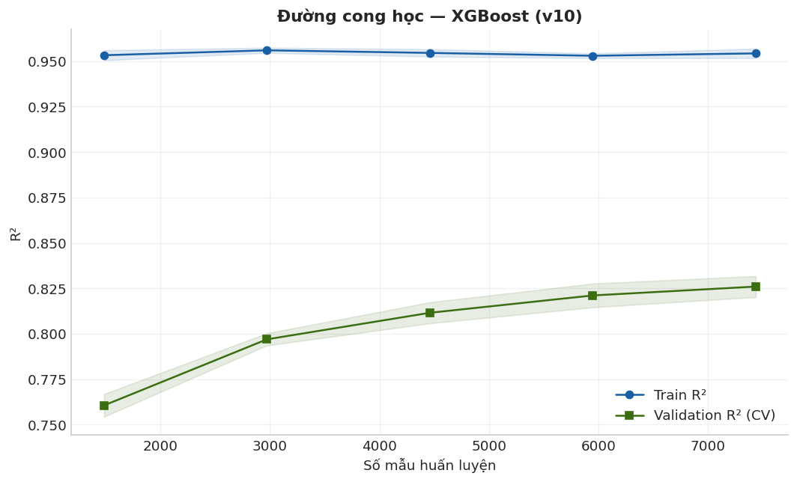

*Hình 3.7. Đường cong học: R² theo kích thước tập huấn luyện.*

**Phân tích SHAP:** Kết quả phân tích SHAP (Hình 3.8, 3.9) xác nhận tuổi máy và tình trạng có tương tác ảnh hưởng đến giá; thông tin pin và từ khóa lỗi làm giảm giá dự đoán, phù hợp với trực giác thị trường.

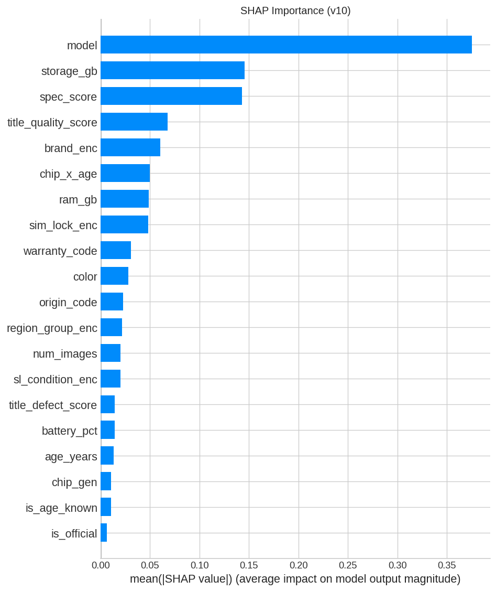

*Hình 3.8. Biểu đồ SHAP summary: ảnh hưởng của từng đặc trưng đến giá dự đoán.*

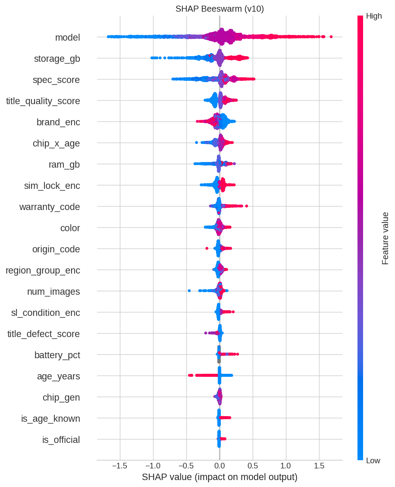

*Hình 3.9. Xếp hạng độ quan trọng đặc trưng theo giá trị trung bình |SHAP|.*

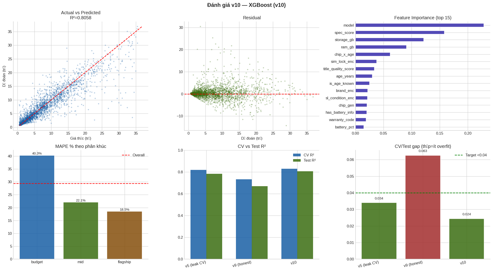

*Hình 3.10. Bảng tổng hợp kết quả đánh giá: scatter plot, phân tích residual, so sánh chỉ số và feature importance.*

## 3.2. Triển khai dịch vụ suy luận

### 3.2.1. Cấu trúc mã nguồn AI Service

Dịch vụ suy luận được triển khai tại thư mục `aiservice/`, gồm các thành phần:

- `features.py`: tái tạo logic trích chọn đặc trưng đồng nhất với notebook huấn luyện.
- `predictor.py`: nạp artifacts, thực hiện suy luận và tính khoảng giá.
- `routes.py`: cung cấp endpoint REST API.
- `scripts/colab_export_v10.py`: xuất mô hình sau huấn luyện.

Sau khi huấn luyện trên Colab, các tệp `xgb_model.json`, `preprocessor.pkl`, `label_encoders.pkl` và `artifacts.json` được sao chép vào `aiservice/models/` và mount vào container Docker.

### 3.2.2. Quy trình suy luận

Khi nhận yêu cầu định giá, dịch vụ thực hiện: kiểm tra tính hợp lệ đầu vào → trích chọn 26 đặc trưng → biến đổi qua preprocessor → dự đoán trên thang log → chuyển về VND → tính khoảng giá và mức tin cậy → trả kết quả JSON.

### 3.2.3. Triển khai container

AI Service được đóng gói bằng Docker, chạy Gunicorn với 2 worker, cổng 8090. Healthcheck endpoint `/health` báo trạng thái nạp mô hình. Cấu hình trong `docker-compose.yml` mount thư mục models ở chế độ read-only.

## 3.3. Tích hợp với Product Service

Product Service đóng vai trò trung gian giữa giao diện người dùng và AI Service:

- `AiController` tiếp nhận yêu cầu tại `/ai/suggest-price`.
- `AiServiceImpl` kiểm tra điều kiện danh mục và loại tin đăng.
- `PhonePricingRequestMapper` chuyển đổi dữ liệu nghiệp vụ sang định dạng mô hình.
- `PhonePricingClient` gọi AI Service và ánh xạ kết quả trả về.

Hệ thống xử lý các trường hợp lỗi: thiếu thông tin đầu vào (HTTP 400), mô hình chưa sẵn sàng (HTTP 503), dịch vụ AI không khả dụng (mã lỗi nghiệp vụ).

## 3.4. Tổng hợp kết quả

**Bảng 3.2. Tổng hợp chỉ số hệ thống**

| Chỉ số | Giá trị |
|--------|---------|
| Hệ số xác định (Test R²) | 0,8058 |
| Hệ số xác định (CV R²) | 0,8301 |
| Sai số tuyệt đối trung bình (MAE) | 1,81 triệu VND |
| Sai số phần trăm trung bình (MAPE) | 29,4% |
| Số đặc trưng đầu vào | 26 |
| Tập huấn luyện | 9.912 mẫu |
| Tập kiểm thử | 2.479 mẫu |

## 3.5. Đánh giá và hạn chế

### 3.5.1. Ưu điểm

Hệ thống đạt được các ưu điểm sau:

1. Sử dụng phương pháp mã hóa biến phân loại trung thực, tránh đánh giá lạc quan.
2. Khai thác đồng thời đặc trưng cấu trúc, văn bản và metadata tin đăng.
3. Tích hợp thực tế vào nền tảng Second Life theo kiến trúc microservice.
4. Đồng bộ logic huấn luyện và suy luận, giảm sai lệch khi triển khai.
5. Đạt Test R² = 0,806 với MAE khoảng 1,81 triệu VND trên thị trường đồ cũ nhiễu.

### 3.5.2. Hạn chế

| Hạn chế | Hướng khắc phục |
|---------|-----------------|
| Chỉ hỗ trợ điện thoại, tin bán | Mở rộng sang danh mục và loại hình cho thuê |
| Dữ liệu huấn luyện từ Chợ Tốt | Thu thập phản hồi từ Second Life, huấn luyện lại định kỳ |
| MAPE ~29% | Bổ sung phân tích hình ảnh sản phẩm |
| Model mới chưa có trong tập huấn luyện | Cơ chế cold-start hoặc embedding |
| Quy trình export phụ thuộc Colab | Tự động hóa pipeline huấn luyện (CI/CD) |

### 3.5.3. Hướng phát triển

- Tích hợp mô hình đa phương thức (ảnh + bảng đặc trưng).
- Cập nhật mô hình từ dữ liệu giao dịch thực trên Second Life.
- Mở rộng sang laptop, máy ảnh và thiết bị điện tử khác.
- Cung cấp giải thích dự đoán theo thời gian thực (SHAP) trong phản hồi API.

---

# Kết luận

Đồ án đã xây dựng thành công hệ thống gợi ý giá điện thoại cũ dựa trên học máy, huấn luyện trên tập dữ liệu 12.391 tin đăng từ Chợ Tốt và tích hợp vào nền tảng Second Life. Mô hình XGBoost đạt hệ số xác định R² = 0,806 trên tập kiểm thử, với sai số tuyệt đối trung bình khoảng 1,81 triệu VND.

Quá trình phân tích dữ liệu cho thấy giá bán phụ thuộc mạnh vào model, cấu hình phần cứng, tình trạng máy, tuổi đời sản phẩm và nội dung mô tả tin đăng. Việc áp dụng Target Encoding với cross-fit, kết hợp trích xuất tín hiệu văn bản, góp phần nâng cao đáng kể chất lượng dự đoán so với các phương pháp mã hóa đơn giản.

Hệ thống được triển khai dưới dạng microservice độc lập, đảm bảo khả năng mở rộng và bảo trì. Kết quả thực nghiệm khẳng định tính khả thi của việc ứng dụng học máy trong hỗ trợ định giá sản phẩm trên sàn thương mại điện tử đồ cũ tại Việt Nam.

---

# Danh mục hình ảnh

| Ký hiệu | Tên hình | Tệp |
|---------|----------|-----|
| Hình 2.1 | Tổng quan tập dữ liệu huấn luyện | `images/phone-pricing/figS1.png` |
| Hình 2.2 | Phân tích giá theo hãng, tình trạng, khu vực | `images/phone-pricing/figS2.png` |
| Hình 2.3 | Tín hiệu văn bản và giá bán | `images/phone-pricing/figS4.png` |
| Hình 2.4 | Giá bán theo thông số kỹ thuật | `images/phone-pricing/figS5.png` |
| Hình 2.5 | Ma trận tương quan đặc trưng | `images/phone-pricing/figS3.png` |
| Hình 2.6 | Khảo sát sơ bộ dữ liệu | `images/phone-pricing/eda_v10.png` |
| Hình 2.7 | Kiến trúc pipeline định giá | `images/phone-pricing/figS6.png` |
| Hình 2.8 | Kiến trúc hệ thống Second Life | `../diagrams/system_architecture/SystemArchitecture.jpg` |
| Hình 3.1 | Quá trình tối ưu siêu tham số Optuna | `images/phone-pricing/figS7.png` |
| Hình 3.2 | Kết quả 5-fold cross-validation | `images/phone-pricing/figS8.png` |
| Hình 3.3 | Giá thực tế và giá dự đoán | `images/phone-pricing/fig3.png` |
| Hình 3.4 | Phân phối sai số | `images/phone-pricing/fig4.png` |
| Hình 3.5 | Sai số theo phân khúc và hãng | `images/phone-pricing/fig5.png` |
| Hình 3.6 | Mức độ quan trọng đặc trưng | `images/phone-pricing/fig6.png` |
| Hình 3.7 | Đường cong học | `images/phone-pricing/fig7.png` |
| Hình 3.8 | Phân tích SHAP tổng hợp | `images/phone-pricing/hinh_shap_summary.png` |
| Hình 3.9 | Độ quan trọng đặc trưng theo SHAP | `images/phone-pricing/hinh_shap_bar.png` |
| Hình 3.10 | Đánh giá tổng hợp mô hình | `images/phone-pricing/hinh_danh_gia_tong_hop.png` |

---

## Tài liệu tham khảo kỹ thuật

| Nội dung | Đường dẫn trong dự án |
|----------|----------------------|
| Notebook huấn luyện | `aiservice/train/phone_price_pipeline_vnd_v10.ipynb` |
| Mã nguồn AI Service | `aiservice/app/` |
| Tích hợp Product Service | `productservice/.../PhonePricingRequestMapper.java` |
| Cấu hình triển khai | `docker-compose.yml` |
| Kiến trúc hệ thống | [architecture.md](./architecture.md) |
