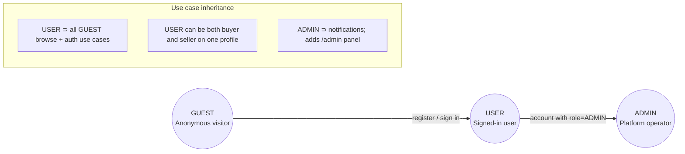
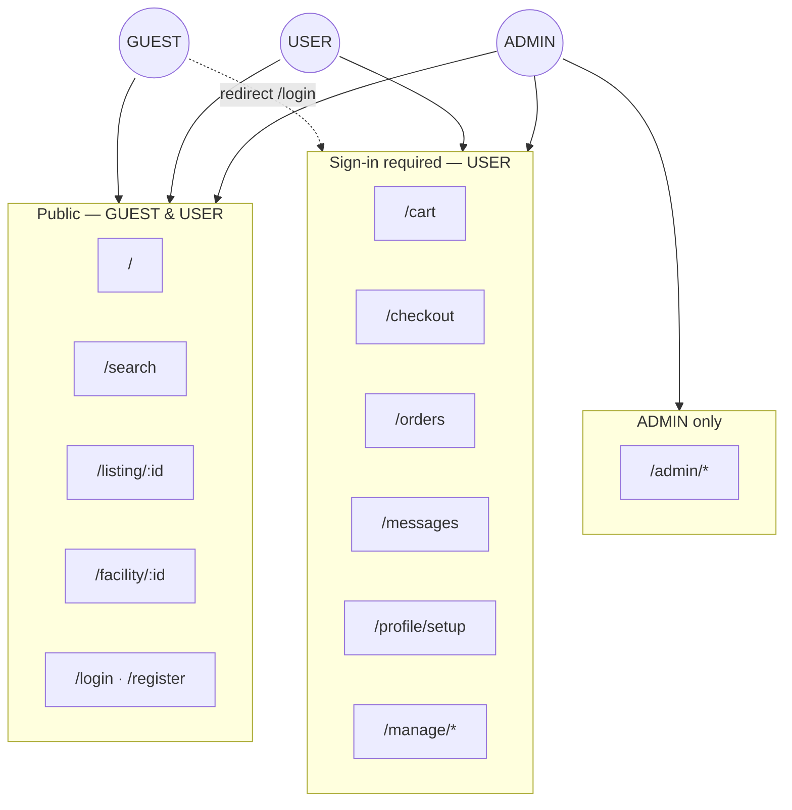
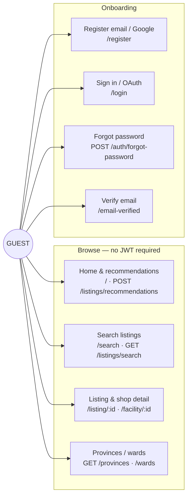
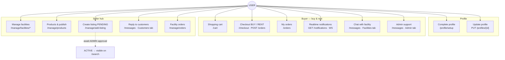
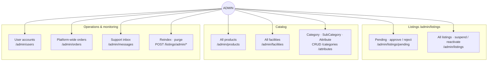
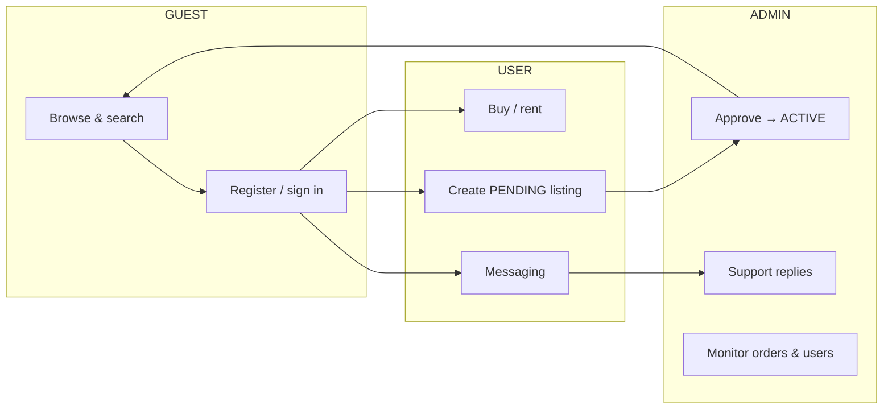

# Use cases — GUEST, USER, ADMIN

Three roles: **GUEST** (no JWT), **USER** (`role = USER`), **ADMIN** (`role = ADMIN`). Traefik forward-auth injects `X-Profile-Id` and `role` after authentication; public GET endpoints work without a JWT.

## Role relationships

## Route map by role

## GUEST — use cases

## USER — use cases

## ADMIN — use cases

## Cross-role main flow

Detailed messaging flows (FACILITY + ADMIN): [mailservice/README.md](../mailservice/README.md).
