# inventoryservice

Stock and reservation service for listing variants: tracks BUY/RENT quantities per `listing_variant_id` and manages time-bounded reservations consumed by **bookingservice**.

- **Context path:** `/api/v1`
- **Default port:** configured via `SERVER_PORT_INVENTORY_SERVICE`

## Stack

| Component | Version / notes |
| --- | --- |
| Java | 21 |
| Spring Boot | Web, Validation, Data JPA |
| MySQL | |
| Spring Kafka | Reservation create/release events |
| Internal deps | `commonjpa`, `commonservice` |

## Data model (JPA)

`listing_variant_id` references product-service listing variants (cross-service, no JPA FK).

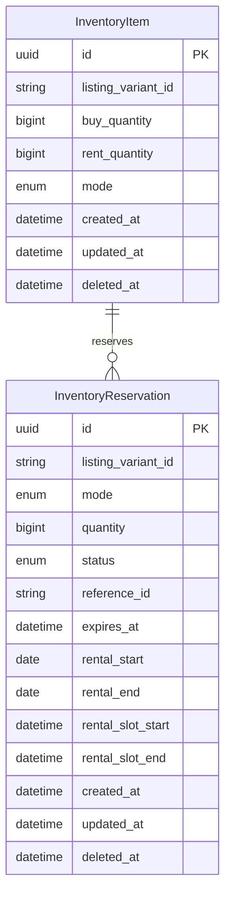

### Reservation statuses

| Status | Meaning |
| --- | --- |
| `PENDING` | Held stock, awaiting order confirmation |
| `CONFIRMED` | Linked to a confirmed order |
| `RELEASED` | Cancelled or expired; stock returned |

## Check availability

Stock-check endpoints used by **bookingservice** (pre-checkout) and **UI** (product detail / checkout). They only **read** inventory — no reservation is created or changed.

| Endpoint | Mode | Purpose |
| --- | --- | --- |
| `GET /listing-variants/{id}/availability` | `BUY` (default) or `RENT` | Point-in-time stock |
| `GET /listing-variants/{id}/availability-in-range` | `RENT` (default) | Min free quantity in a rental window `[from, to)` |

**BUY** `/availability` supports two call styles:

| Call style | Query | Behaviour |
| --- | --- | --- |
| **Return stock count** | no `quantity` | Always **200** with `availableQuantity`; caller decides if that is enough |
| **Validate requested amount** | `quantity=N` | **200** if N units are available; **409** if not enough; **404** if item not tracked |

**bookingservice** uses **return stock count** (no `quantity`). **RENT** `/availability-in-range` always uses return-stock-count style (always **200**).

**Active reservation** (subtracted for BUY, blocks intervals for RENT): `status ∈ {PENDING, CONFIRMED}`, `deleted_at IS NULL`, and `expires_at IS NULL OR expires_at > now`.

| Mode | Formula |
| --- | --- |
| **BUY** (`/availability`) | `available = max(0, buy_quantity − Σ active reserved qty)` |
| **RENT** (`/availability`) | `available = rent_quantity` (physical only; no slot overlap on this endpoint) |
| **RENT** (`/availability-in-range`) | `available = min over sub-intervals of (rent_quantity − overlapping reserved qty)`; each reservation blocks its rental period **plus turnover** (+1 h for hourly slots, +1 day for daily rentals) |

Response shape: `{ tracked: boolean, availableQuantity: number | null }`. If no `InventoryItem` exists for the variant + mode → `tracked = false`, `availableQuantity = null` (HTTP **200**, not 404). `/availability-in-range` also echoes `intervalStart` / `intervalEnd`.

### Sequence diagrams

| # | Diagram name | Endpoint |
| --- | --- | --- |
| 1 | [Check availability — BUY: return stock count](#1-check-availability--buy-return-stock-count) | `GET /availability?mode=BUY` |
| 2 | [Check availability — BUY: validate requested amount](#2-check-availability--buy-validate-requested-amount) | `GET /availability?mode=BUY&quantity=N` |
| 3 | [Check availability — RENT: slot capacity in range](#3-check-availability--rent-slot-capacity-in-range) | `GET /availability-in-range?mode=RENT&from=&to=` |

#### 1. Check availability — BUY: return stock count

Used by **bookingservice** checkout and UI stock display. Request has **no** `quantity` param.

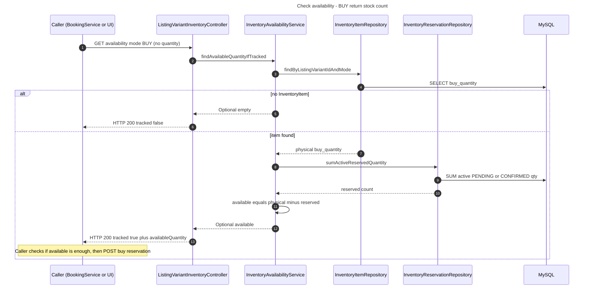

#### 2. Check availability — BUY: validate requested amount

Used by **UI** when validating a specific quantity on a form. Request includes `quantity=N`.

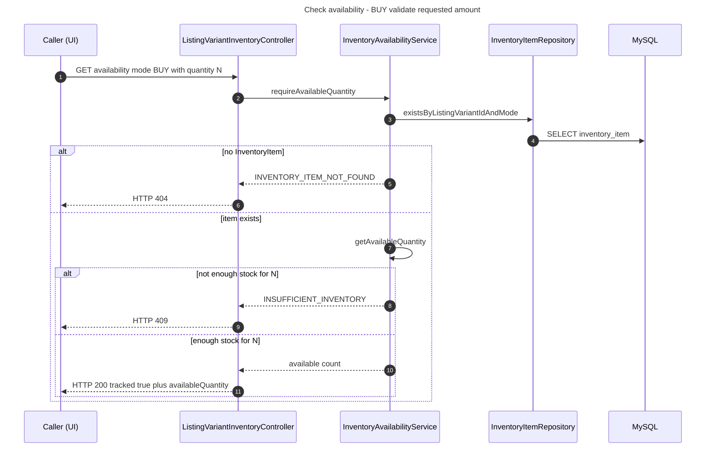

#### 3. Check availability — RENT: slot capacity in range

Used by **bookingservice** checkout and UI rental calendar. Always returns stock count for the window (always **200**).

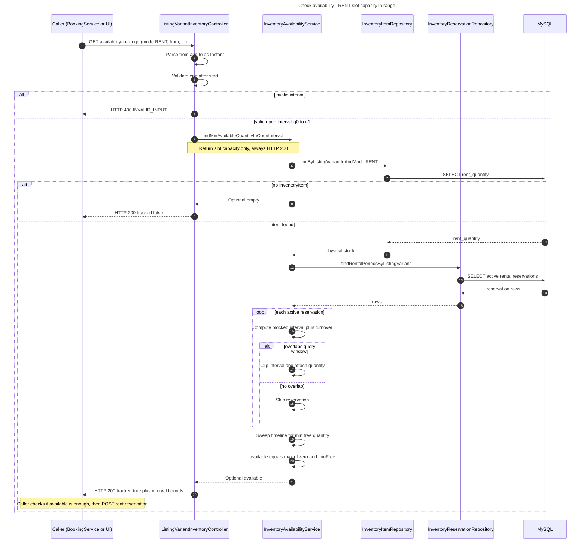

## Main flows

Called synchronously by **bookingservice** during checkout (triggered by **USER** from `/checkout`). Kafka topic `inventory.reservation.create` runs the same logic asynchronously.

### End-to-end: USER buys (BUY)

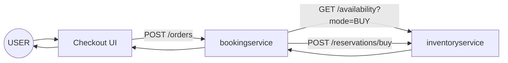

See [Check availability — BUY: return stock count](#1-check-availability--buy-return-stock-count) for the stock probe. Summary after a successful check:

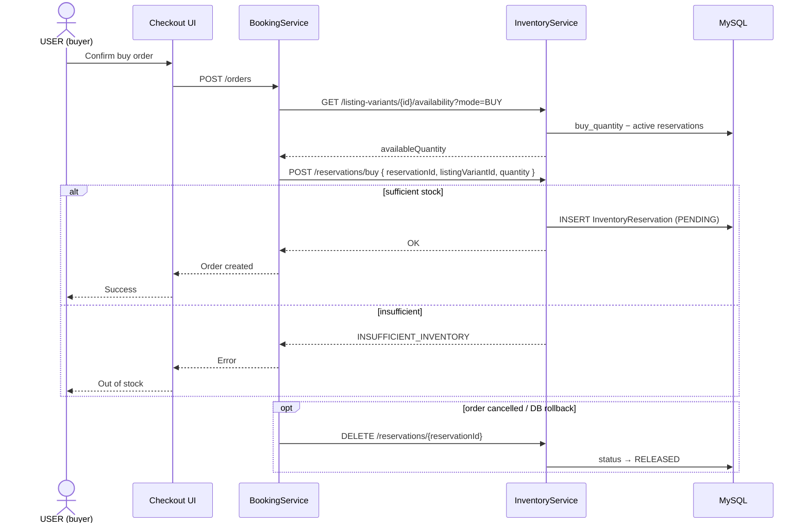

### End-to-end: USER rents (RENT)

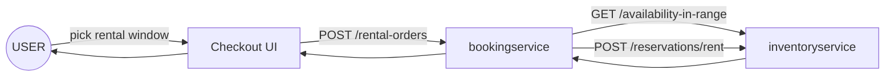

See [Check availability — RENT: slot capacity in range](#3-check-availability--rent-slot-capacity-in-range) for the slot probe. Summary after a successful check:

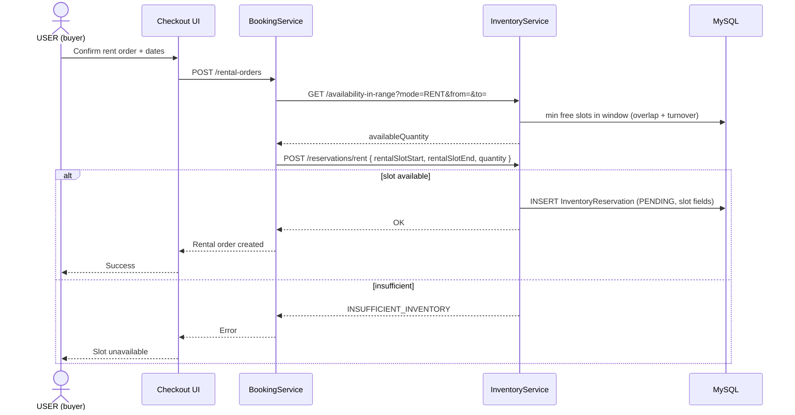

### BUY — create and release reservation (service-to-service)

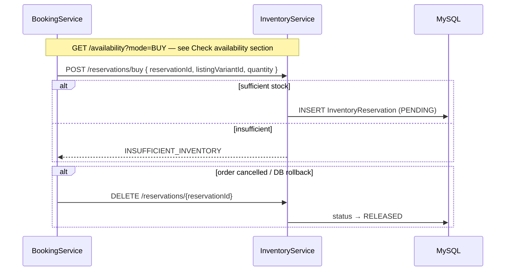

### RENT — slot availability and reservation (service-to-service)

See [Check availability — RENT: slot capacity in range](#3-check-availability--rent-slot-capacity-in-range) for the slot probe. Summary after a successful check:

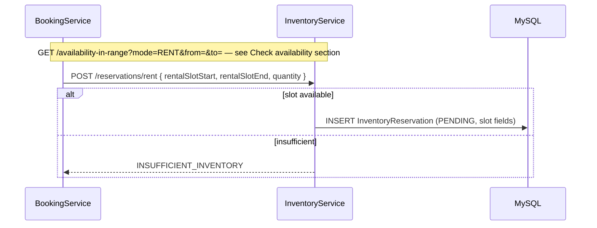

### Inventory bootstrap from new listing

When a seller creates a listing, **productservice** publishes `inventory.item.create`.

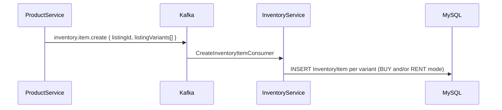

## Local setup

```bash
cp src/main/resources/application-dev.yml.example src/main/resources/application-dev.yml
mvn spring-boot:run -Dspring-boot.run.profiles=dev
```

From repo root:

```bash
mvn spring-boot:run -pl inventoryservice -am -Dspring-boot.run.profiles=dev
```

## Common environment variables

| Variable | Description |
|------|--------|
| `SERVER_PORT_INVENTORY_SERVICE` | HTTP port |
| `MYSQL_URL` / `MYSQL_USERNAME` / `MYSQL_PASSWORD` | Database |
| `KAFKA_BOOTSTRAP_SERVERS` | Kafka broker |
