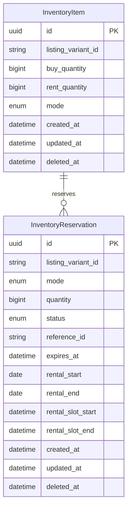
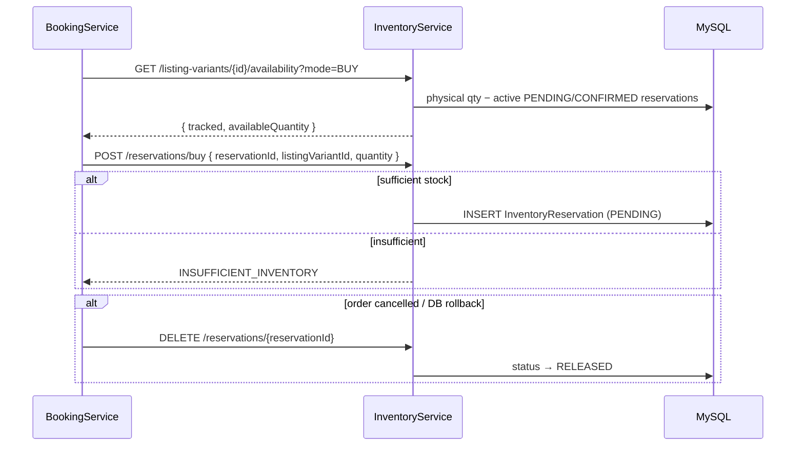
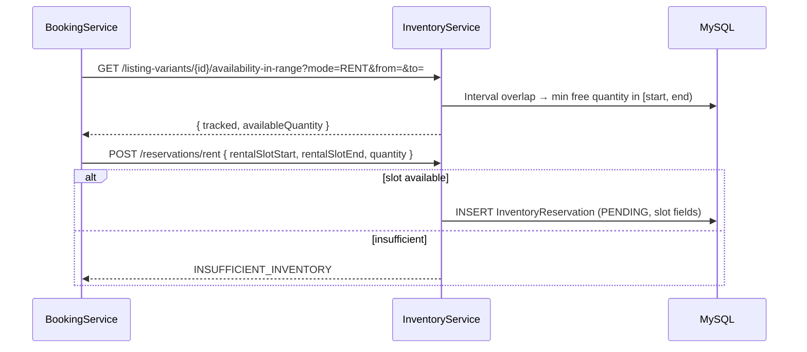
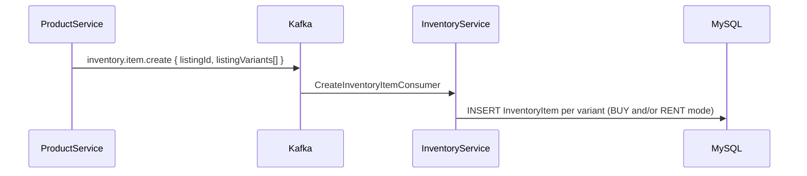

# inventoryservice

Stock and reservation service for listing variants: tracks BUY/RENT quantities per `listing_variant_id` and manages time-bounded reservations consumed by **bookingservice**.

- **Context path:** `/api/v1`
- **Default port:** configured via `SERVER_PORT_INVENTORY_SERVICE`

## Stack

| Component | Version / notes |
| --- | --- |
| Java | 21 |
| Spring Boot | Web, Validation, Data JPA |
| MySQL | |
| Spring Kafka | Reservation create/release events |
| Internal deps | `commonjpa`, `commonservice` |

## Data model (JPA)

`listing_variant_id` references product-service listing variants (cross-service, no JPA FK).



### Reservation statuses

| Status | Meaning |
| --- | --- |
| `PENDING` | Held stock, awaiting order confirmation |
| `CONFIRMED` | Linked to a confirmed order |
| `RELEASED` | Cancelled or expired; stock returned |

## Main flows

Called synchronously by **bookingservice** during checkout. Kafka topic `inventory.reservation.create` runs the same logic asynchronously.

### BUY — create and release reservation



### RENT — slot availability and reservation



### Inventory bootstrap from new listing

When a seller creates a listing, **productservice** publishes `inventory.item.create`.



## Local setup

```bash
cp src/main/resources/application-dev.yml.example src/main/resources/application-dev.yml
mvn spring-boot:run -Dspring-boot.run.profiles=dev
```

From repo root:

```bash
mvn spring-boot:run -pl inventoryservice -am -Dspring-boot.run.profiles=dev
```

## Common environment variables

| Variable | Description |
|------|--------|
| `SERVER_PORT_INVENTORY_SERVICE` | HTTP port |
| `MYSQL_URL` / `MYSQL_USERNAME` / `MYSQL_PASSWORD` | Database |
| `KAFKA_BOOTSTRAP_SERVERS` | Kafka broker |
