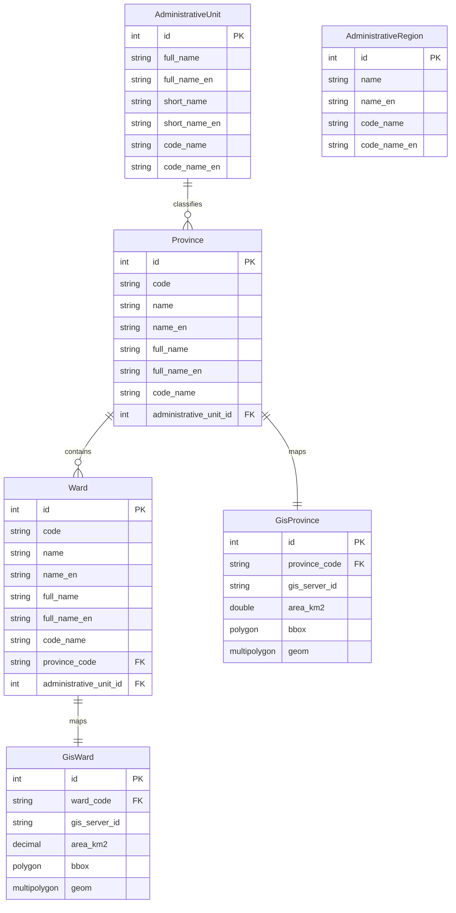

# locationservice

Dữ liệu hành chính Việt Nam (tỉnh, phường/xã, đơn vị hành chính) và **bản đồ GIS** (JTS Geometry: bbox, polygon). Cache Redis.

## Công nghệ

| Thành phần | Phiên bản / ghi chú |
| --- | --- |
| Java | 21 |
| Spring Boot | Web, Data JPA, Cache |
| MySQL | Connector + spatial columns (`POLYGON`, `MULTIPOLYGON SRID 4326`) |
| Redis | Cache |
| JTS Core | 1.20.0 (geometry) |
| OpenAPI | springdoc |
| Lombok | |
| Phụ thuộc nội bộ | `commonjpa`, `commonservice` |

## Mô hình dữ liệu (JPA)

Trong source, **`AdministrativeRegion`** là entity độc lập (chưa thấy quan hệ JPA với các bảng khác).

