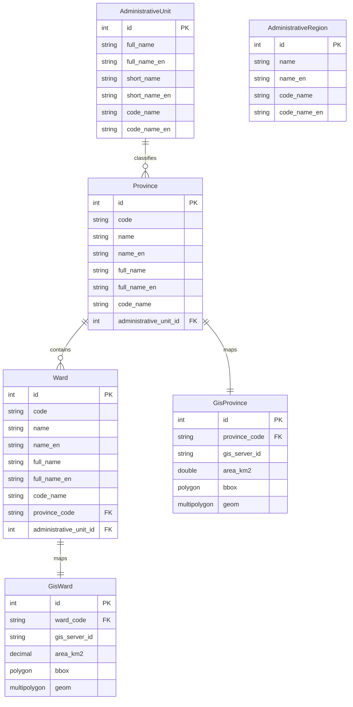
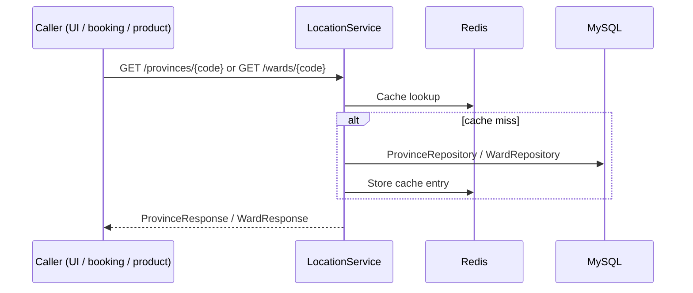
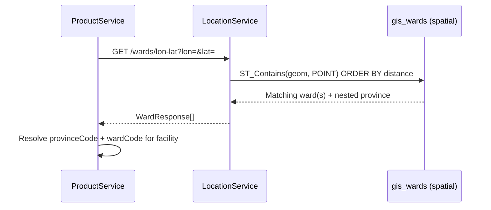
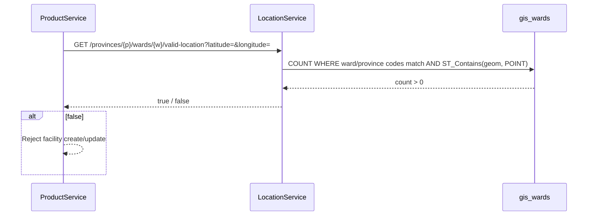

# locationservice

Vietnamese administrative data (provinces, wards/communes, administrative units) and **GIS maps** (JTS Geometry: bbox, polygon). Redis-backed caching.

## Stack

| Component | Version / notes |
| --- | --- |
| Java | 21 |
| Spring Boot | Web, Data JPA, Cache |
| MySQL | Connector + spatial columns (`POLYGON`, `MULTIPOLYGON SRID 4326`) |
| Redis | Cache |
| JTS Core | 1.20.0 (geometry) |
| OpenAPI | springdoc |
| Lombok | |
| Internal deps | `commonjpa`, `commonservice` |

## Data model (JPA)

In source, **`AdministrativeRegion`** is a standalone entity (no JPA relationship to other tables in this service).

## Main flows

Base path: `/api/v1`. Province/ward reads are **Redis-cached** (`@Cacheable`).

### Province / ward lookup

Used by checkout (**bookingservice**), facility forms (**productservice**), and the UI.

### Reverse geocoding (coordinates → ward)

### Facility pin validation (point-in-polygon)

## Common environment variables

| Variable | Description |
|------|--------|
| `SERVER_PORT_LOCATION_SERVICE` | HTTP port |
| `MYSQL_URL` / `MYSQL_USERNAME` / `MYSQL_PASSWORD` | Administrative + GIS data |
| `REDIS_*` | Cache for province/ward reads |
