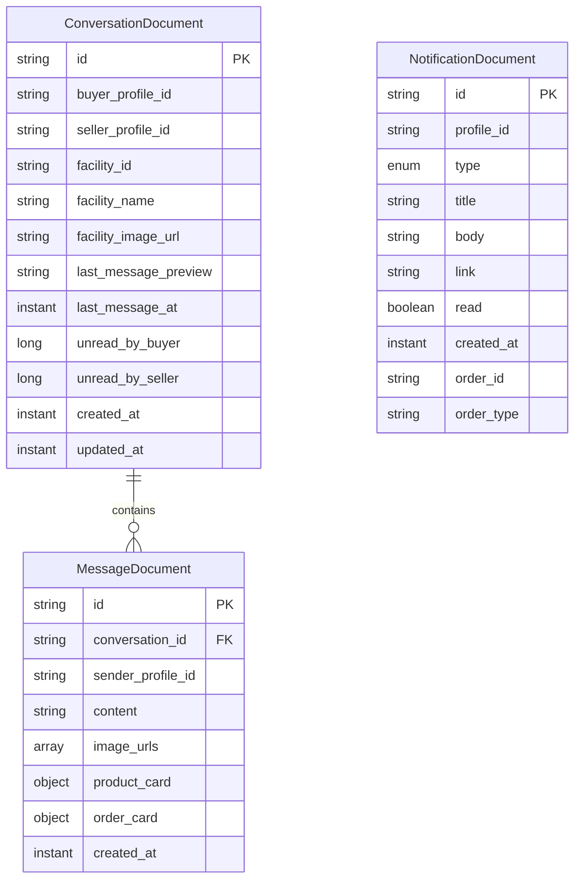
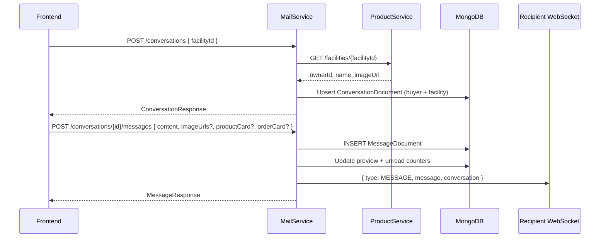
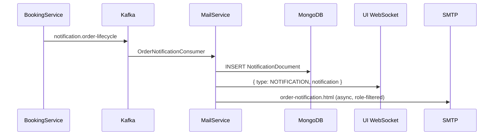
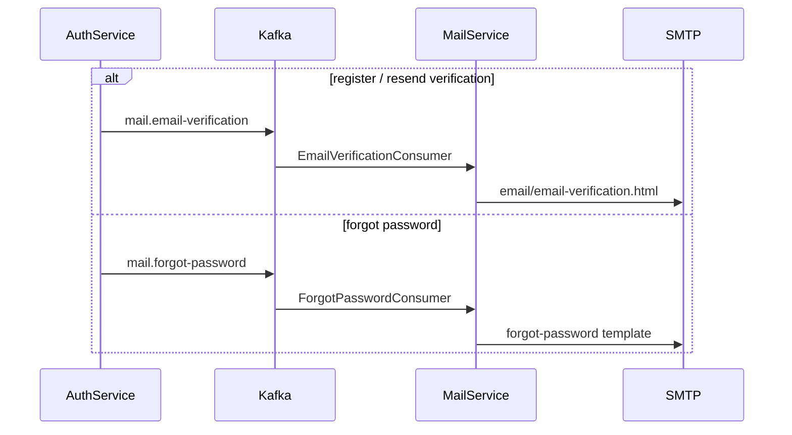
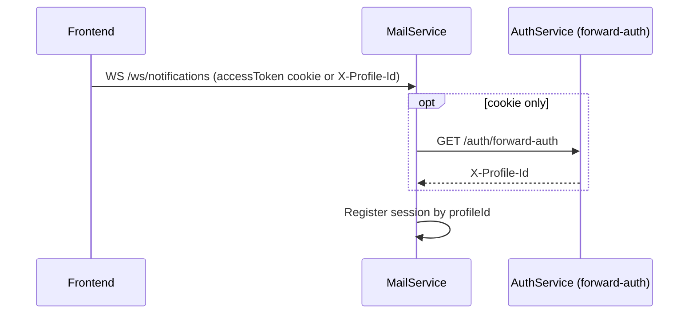

# mailservice

Email delivery (Spring Mail + Thymeleaf templates), in-app notifications, buyer–seller messaging, and real-time WebSocket pushes. Consumes Kafka events (e.g. forgot password, email verification).

## Stack

| Component | Version / notes |
| --- | --- |
| Java | 21 |
| Spring Boot | Mail, Thymeleaf, Validation, WebSocket |
| MongoDB | Conversations, messages, notifications |
| Spring Kafka | Event consumers (per environment) |
| OpenAPI | springdoc |
| Lombok | |
| Internal deps | `commonservice` |

## Data model (MongoDB)

Embedded value objects: `MessageProductCard`, `MessageOrderCard` (not separate collections).

| Collection | Description |
| --- | --- |
| `notifications` | Order/system notifications keyed by `profileId` |
| `conversations` | Threads between a buyer and a facility (seller) |
| `messages` | Messages within a conversation |

### Conversations API (`/api/v1/conversations`)

- `GET ?role=buyer|seller` — list conversations
- `POST` `{ "facilityId": "..." }` — create or fetch a conversation with a facility
- `GET /{id}/messages` — message history
- `POST /{id}/messages` `{ "content": "..." }` — send a message
- `PATCH /{id}/read` — mark as read

WebSocket `/api/v1/ws/notifications` pushes `type: "MESSAGE"` events when new messages arrive.

Message payloads support:

- Text (`content`)
- Images (`imageUrls`, uploaded to Cloudinary from the UI)
- Product card (`productCard`: listingId, title, thumbnail, …)
- Order card (`orderCard`: orderId, status, title, …)

## Main flows

Base path: `/api/v1`. WebSocket: `/ws/notifications`.

### Buyer–seller messaging

### Order lifecycle notification (Kafka → in-app + email)

Published by **bookingservice** on order create, confirm, cancel, status change.

### Auth transactional email

### WebSocket handshake

## Common environment variables

| Variable | Description |
|------|--------|
| `SERVER_PORT_MAIL_SERVICE` | HTTP port |
| `MONGODB_URI` | MongoDB connection |
| `KAFKA_BOOTSTRAP_SERVERS` | Kafka broker |
| `SPRING_MAIL_*` | SMTP settings |
