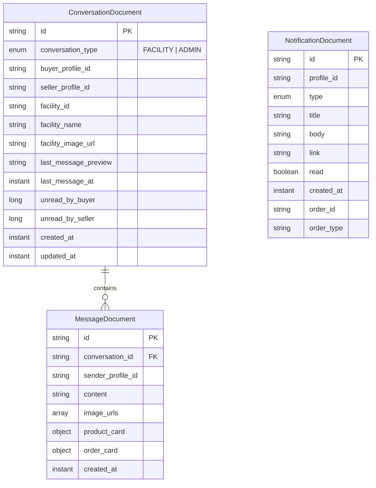
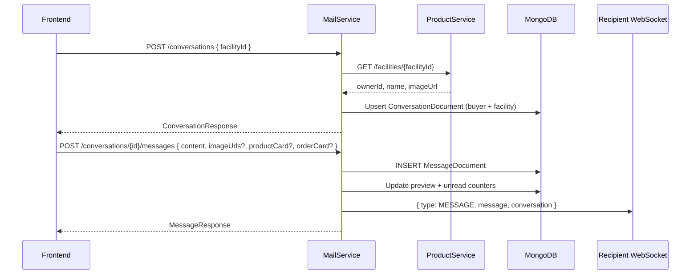
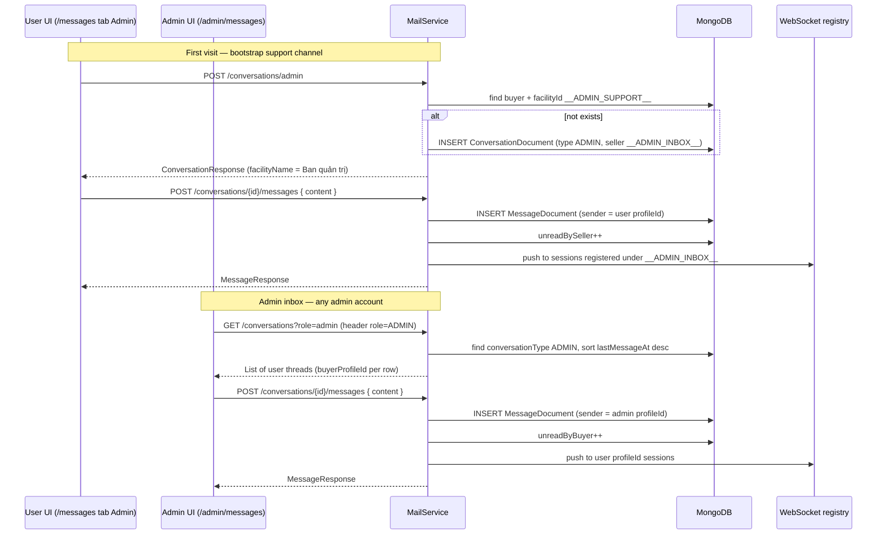
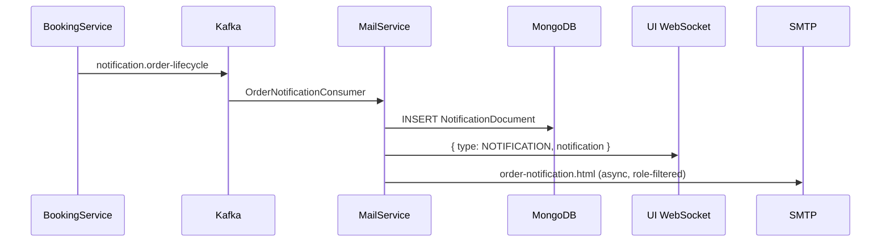
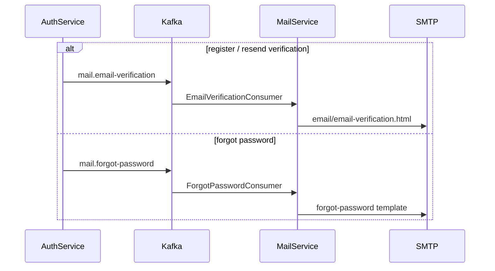
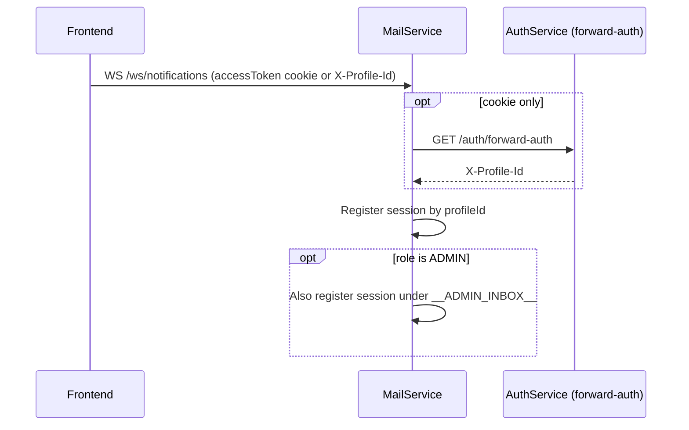

# mailservice

Email delivery (Spring Mail + Thymeleaf templates), in-app notifications, buyer–seller messaging, **user–admin support chat**, and real-time WebSocket pushes. Consumes Kafka events (e.g. forgot password, email verification).

## Stack

| Component | Version / notes |
| --- | --- |
| Java | 21 |
| Spring Boot | Mail, Thymeleaf, Validation, WebSocket |
| MongoDB | Conversations, messages, notifications |
| Spring Kafka | Event consumers (per environment) |
| OpenAPI | springdoc |
| Lombok | |
| Internal deps | `commonservice` |

## Data model (MongoDB)

Embedded value objects: `MessageProductCard`, `MessageOrderCard` (not separate collections).

| Collection | Description |
| --- | --- |
| `notifications` | Order/system notifications keyed by `profileId` |
| `conversations` | Chat threads — see [conversation types](#conversation-types) below |
| `messages` | Messages within a conversation |

### Conversation types

All threads live in the same `conversations` collection. They are distinguished by `conversationType` (default `FACILITY` for legacy rows).

| Type | Who chats | `buyerProfileId` | `sellerProfileId` | `facilityId` | UI |
| --- | --- | --- | --- | --- | --- |
| **FACILITY** | Buyer ↔ facility owner | Buyer profile | Facility `ownerId` | Real facility UUID | `/messages` tabs **Cơ sở** (buyer) and **Khách** (seller) |
| **ADMIN** | User ↔ admin team | User profile | Sentinel `__ADMIN_INBOX__` | Sentinel `__ADMIN_SUPPORT__` | `/messages` tab **Admin** (user); `/admin/messages` inbox (admin) |

Sentinel values are defined in `ConversationConstants`:

- `ADMIN_INBOX_PROFILE_ID` — virtual “seller” for admin-side unread + WebSocket routing (shared inbox for all admins).
- `ADMIN_SUPPORT_FACILITY_ID` — reuses the existing unique index `(buyerProfileId, facilityId)` so each user has **at most one** support thread.
- `ADMIN_SUPPORT_FACILITY_NAME` — display label (`Ban quản trị`) in API responses.

Unread counters:

| Side | FACILITY thread | ADMIN thread |
| --- | --- | --- |
| Buyer / user | `unreadByBuyer` | `unreadByBuyer` |
| Seller / admin | `unreadBySeller` (owner profile) | `unreadBySeller` (admin inbox) |

When a message is sent, `persistMessage` increments the **recipient** counter: buyer sends → `unreadBySeller++`, otherwise → `unreadByBuyer++`.

### Conversations API (`/api/v1/conversations`)

| Method | Path | Who | Purpose |
| --- | --- | --- | --- |
| `GET` | `?role=buyer` | User | Facility chats as buyer (`conversationType != ADMIN`) |
| `GET` | `?role=seller` | Facility owner | Facility chats as seller (`conversationType != ADMIN`) |
| `GET` | `?role=admin-support` | User (non-admin) | User’s support thread(s) (`conversationType = ADMIN`) |
| `GET` | `?role=admin` | Admin (`role` header) | All user support threads |
| `POST` | `/` | User | Get or create **FACILITY** chat `{ "facilityId": "..." }` |
| `POST` | `/admin` | User (non-admin) | Get or create **ADMIN** support thread |
| `GET` | `/{id}/messages` | Participant or admin on ADMIN threads | Message history |
| `POST` | `/{id}/messages` | Participant or admin on ADMIN threads | Send message |
| `PATCH` | `/{id}/read` | Participant or admin on ADMIN threads | Clear unread for viewer’s side |

Traefik forward-auth injects `X-Profile-Id` and `role` (`ADMIN` / `USER`). `ConversationController` uses `role` for admin inbox access; message endpoints pass `adminRole` into `ConversationService`.

**Access control** (`canAccessConversation`):

- Buyer or seller profile on the document → allowed.
- `role = ADMIN` **and** `conversationType = ADMIN` → allowed (any admin can read/reply; `senderProfileId` is the admin’s real profile).

WebSocket `/api/v1/ws/notifications` pushes `type: "MESSAGE"` events when new messages arrive.

Message payloads support:

- Text (`content`)
- Images (`imageUrls`, uploaded to Cloudinary from the UI)
- Product card (`productCard`: listingId, title, thumbnail, …) — typically FACILITY chats only
- Order card (`orderCard`: orderId, status, title, …) — typically FACILITY chats only

## Main flows

Base path: `/api/v1`. WebSocket: `/ws/notifications`.

Implementation entry points:

| Layer | Path |
| --- | --- |
| REST | `ConversationController` |
| Domain | `ConversationService` |
| Persistence | `ConversationRepository`, `MessageRepository` |
| Realtime | `NotificationWebSocketHandler`, `NotificationWebSocketSessionRegistry` |
| Frontend | `ui/artifacts/second-life/src/pages/Messages/` (`useMessagesPage`, `MessagesPage`) |
| Admin UI | `ui/artifacts/second-life/src/pages/Admin/index.tsx` → `MessagesPage mode="admin"` |

### Buyer–seller messaging (FACILITY)

**Frontend (seller hub / marketplace):**

1. User opens a facility or listing → deep link `/messages?facilityId=…` (optional product/order attach).
2. `useMessagesPage` calls `POST /conversations` → opens thread in tab **Cơ sở**.
3. Facility owner sees the same thread under tab **Khách** via `GET ?role=seller`.
4. TanStack Query cache keys: `["conversations", "buyer"]` / `["conversations", "seller"]` (`conversations-cache.ts`).
5. `useNotificationRealtimeSync` merges WebSocket `MESSAGE` events into cache and shows toast.

### User–admin support messaging (ADMIN)

**Frontend behaviour:**

| Actor | Route | Hook / component | API `role` |
| --- | --- | --- | --- |
| User | `/messages` → tab **Admin** | `useMessagesPage({ mode: "default" })` | `admin-support`; auto `POST /conversations/admin` if empty |
| Admin | `/admin/messages` | `useMessagesPage({ mode: "admin" })` | `admin` |
| Admin list | — | `useConversationParticipantProfiles` | Loads buyer name/avatar via `profileservice` |

Admin UI does **not** show facility/customer tabs — only the shared user inbox. Regular users still have three tabs: **Cơ sở**, **Admin**, **Khách** (seller).

Unread badge on the header message icon sums buyer + seller + `admin-support` counts (`use-conversation-unread.ts`).

### WebSocket: admin shared inbox

Facility messages route WebSocket pushes to the recipient’s `profileId`. ADMIN messages to the admin side use the virtual id `__ADMIN_INBOX__`:

1. `NotificationHandshakeInterceptor` stores JWT `role` in the WebSocket session.
2. `NotificationWebSocketHandler` registers the session under the user’s `profileId` **and**, if `role = ADMIN`, also under `__ADMIN_INBOX__`.
3. `ConversationService.pushRealtime` calls `sessionRegistry.sessionsFor(__ADMIN_INBOX__)` when the recipient is the admin inbox sentinel.

Any logged-in admin with an open WebSocket receives new user messages in real time.

### Order lifecycle notification (Kafka → in-app + email)

Published by **bookingservice** on order create, confirm, cancel, status change.

### Auth transactional email

### WebSocket handshake

## Common environment variables

| Variable | Description |
|------|--------|
| `SERVER_PORT_MAIL_SERVICE` | HTTP port |
| `MONGODB_URI` | MongoDB connection |
| `KAFKA_BOOTSTRAP_SERVERS` | Kafka broker |
| `SPRING_MAIL_*` | SMTP settings |
