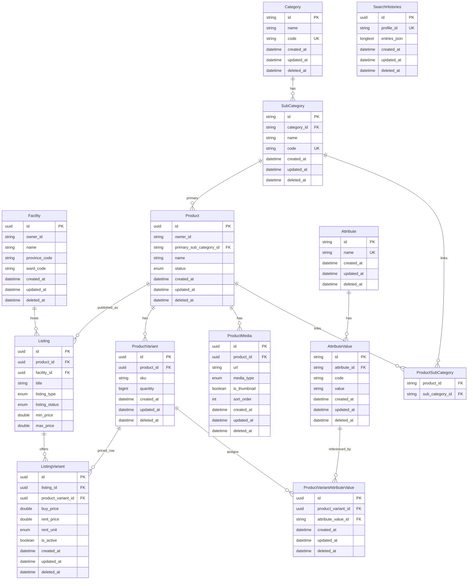

# productservice

Catalog sản phẩm (`Product`, variants, attributes), cơ sở/kho (`Facility`), tin đăng (`Listing`) gắn theo cơ sở, giá variant theo listing. `Product` thuộc chủ sở hữu (`owner_id`) thay vì gắn trực tiếp vào `Facility`. Tích hợp **OpenSearch** (Aiven) cho search; persistence chính trên MySQL.

## Công nghệ

| Thành phần | Phiên bản / ghi chú |
| --- | --- |
| Java | 21 |
| Spring Boot | Web, Validation, Data JPA |
| MySQL | |
| OpenSearch | Spring Data OpenSearch (`spring-data-opensearch-starter`) + `opensearch-java` |
| Jackson YAML | |
| OpenAPI | springdoc |
| Lombok | |
| Phụ thuộc nội bộ | `commonjpa`, `commonservice` |

## Mô hình dữ liệu (JPA)

`Category` và `SubCategory` kế thừa `CatalogItemBase` (mapped superclass: `name`, `code`, … + audit từ `BaseEntity`).

**Ghi chú:** Địa điểm (`province_code`, `ward_code`) trên `Facility` là mã tra cứu với `locationservice`, không có FK JPA.
