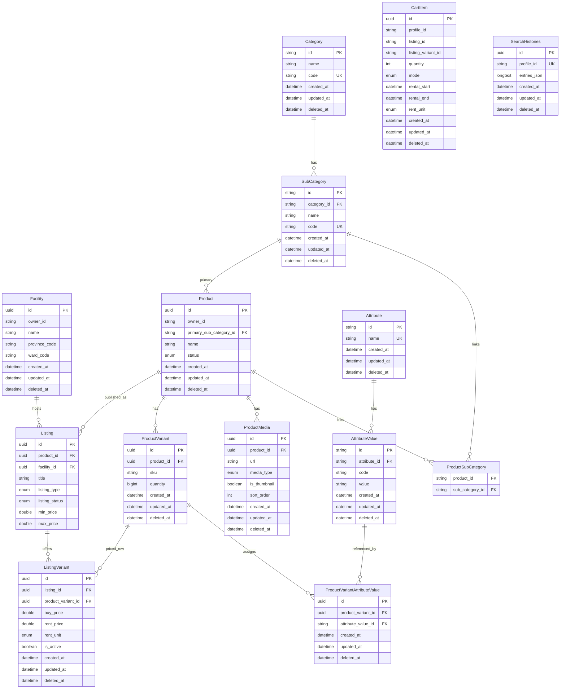
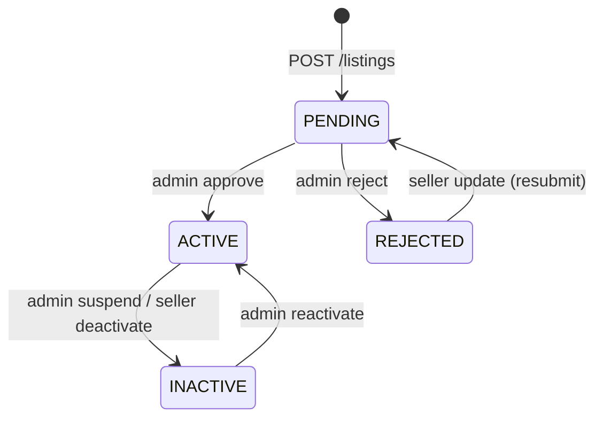
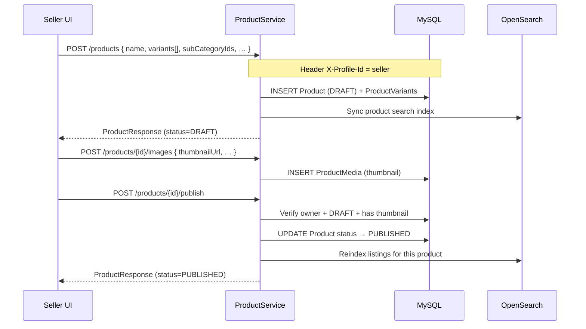
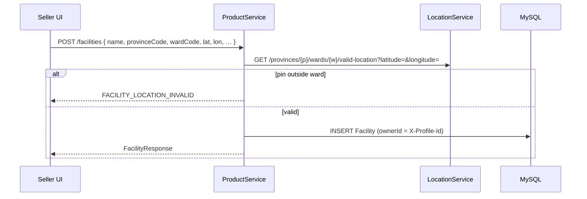
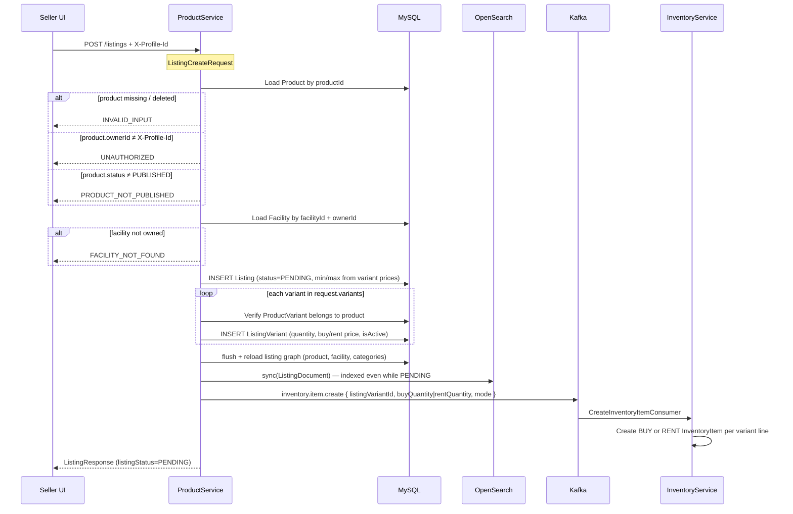
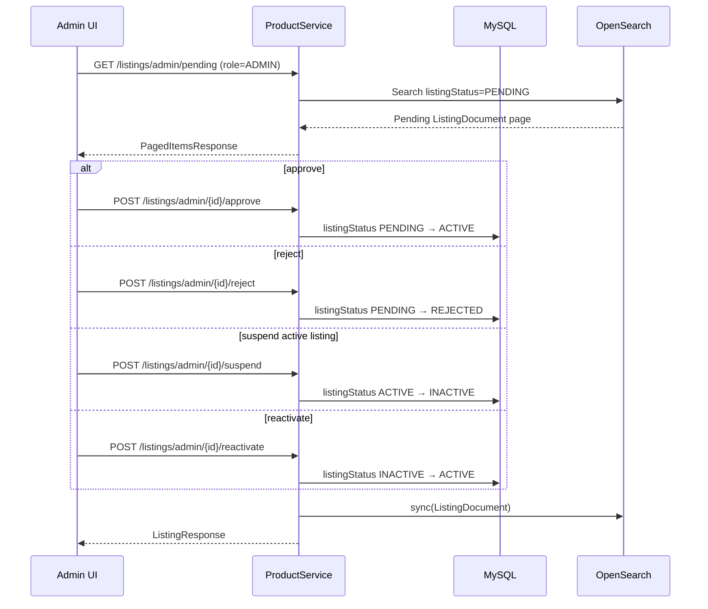
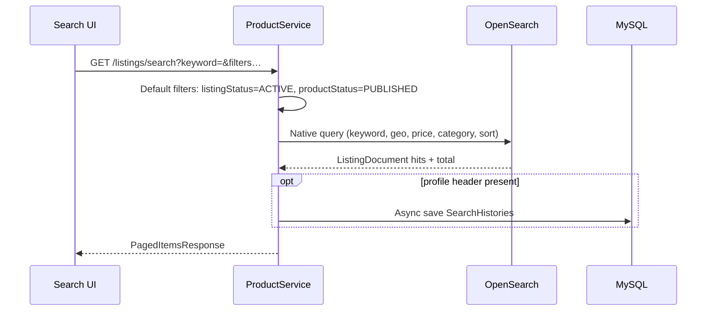
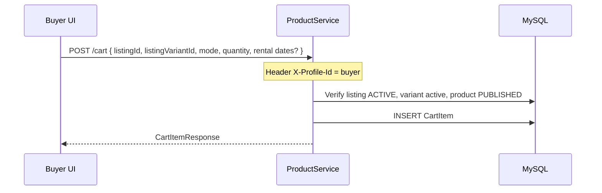

# productservice

Product catalog (`Product`, variants, attributes), facilities/warehouses (`Facility`), listings (`Listing`) per facility, and per-listing variant pricing. `Product` is owned by `owner_id` rather than being tied directly to a `Facility`. Integrates **OpenSearch** (Aiven) for search; primary persistence on MySQL.

## Stack

| Component | Version / notes |
| --- | --- |
| Java | 21 |
| Spring Boot | Web, Validation, Data JPA |
| MySQL | |
| OpenSearch | Spring Data OpenSearch (`spring-data-opensearch-starter`) + `opensearch-java` |
| Jackson YAML | |
| OpenAPI | springdoc |
| Lombok | |
| Internal deps | `commonjpa`, `commonservice` |

## Data model (JPA)

`Category` and `SubCategory` extend `CatalogItemBase` (mapped superclass: `name`, `code`, … + audit from `BaseEntity`).



**Note:** Location codes (`province_code`, `ward_code`) on `Facility` are lookup keys for `locationservice`, not JPA foreign keys.

## Main flows

Base path: `/api/v1`. Seller/admin requests require header `X-Profile-Id`; admin routes also require `role: ADMIN`.

OpenSearch index: `listings`. Kafka topic: `inventory.item.create` (`spring.kafka.topics.create-inventory-item`).

### Listing lifecycle

A listing links a **published product** to a **seller facility** and carries per-variant pricing/stock (`ListingVariant`). New listings start as `PENDING`; only `ACTIVE` listings are visible in public search and cart.

| Status | Meaning | Who sets it |
| --- | --- | --- |
| `PENDING` | Awaiting admin review (default on create) | System on `POST /listings`; seller can resubmit from `REJECTED` via `PUT /listings/{id}` |
| `ACTIVE` | Visible to buyers | Admin `POST /listings/admin/{id}/approve`; admin `POST /listings/admin/{id}/reactivate` |
| `REJECTED` | Moderation failed | Admin `POST /listings/admin/{id}/reject` |
| `INACTIVE` | Temporarily hidden | Admin `POST /listings/admin/{id}/suspend`; seller `PUT /listings/{id}` (`ACTIVE` → `INACTIVE`) |



Public visibility (search, detail, cart): `listingStatus=ACTIVE` **and** `productStatus=PUBLISHED`.

### End-to-end: seller publishes a listing

Four phases. Steps 1–3 are prerequisites; step 4 is listing creation.

| Step | API | Result |
| --- | --- | --- |
| 1 | `POST /products` (`X-Profile-Id`) | Product `DRAFT` + `ProductVariant` rows |
| 2 | `POST /products/{id}/images` | Thumbnail required before publish |
| 3 | `POST /products/{id}/publish` | Product `PUBLISHED`; reindex related listings in OpenSearch |
| 3b | `POST /facilities` (`X-Profile-Id`) | Facility owned by seller (validate pin via locationservice) |
| 4 | `POST /listings` (`X-Profile-Id`) | Listing `PENDING` + variants + OpenSearch sync + Kafka inventory bootstrap |

#### Phase 1–3 — Product draft → published



#### Phase 3b — Create facility (once per warehouse/shop)



#### Phase 4 — Create listing (core flow)

Request body (`ListingCreateRequest`):

```json
{
  "productId": "<published-product-uuid>",
  "facilityId": "<owned-facility-uuid>",
  "title": "Listing title",
  "description": "optional",
  "listingType": "BUY",
  "variants": [
    {
      "productVariantId": "<product-variant-uuid>",
      "quantity": 10,
      "buyPrice": 150000,
      "rentPrice": null,
      "rentUnit": "DAY",
      "isActive": true
    }
  ]
}
```

- `listingType`: `BUY` (default) or `RENT` — drives which price field is used for `minPrice`/`maxPrice` and inventory mode.
- Each variant must reference a `ProductVariant` belonging to `productId`; `quantity` is required (`@NotNull`, `>= 0`).
- If `variants` is empty, listing is saved but **no** Kafka inventory event is published.



**Side effects on create (same transaction, ordered):**

1. MySQL: `listings` + `listing_variants`
2. OpenSearch: upsert `ListingDocument` (admin can query `PENDING` via `/listings/admin/pending`)
3. Kafka → inventoryservice: bootstrap stock rows (`buyQuantity` for `BUY`, `rentQuantity` for `RENT`)

### Admin moderation

Only `PENDING` listings can be approved or rejected. Suspend/reactivate apply to `ACTIVE` / `INACTIVE`.



Seller resubmit after rejection: `PUT /listings/{id}` with `listingStatus: PENDING` (only allowed from `REJECTED`).

### Public listing search



### Add to cart (buyer, after listing is ACTIVE)



## Common environment variables

| Variable | Description |
|------|--------|
| `SERVER_PORT_PRODUCT_SERVICE` | HTTP port |
| `MYSQL_URL` / `MYSQL_USERNAME` / `MYSQL_PASSWORD` | Catalog database |
| `OPENSEARCH_*` / `AIVEN_*` | Search cluster connection |
| `KAFKA_BOOTSTRAP_SERVERS` | Kafka broker |
| `LOCATION_SERVICE_URL` | Ward/province validation |
