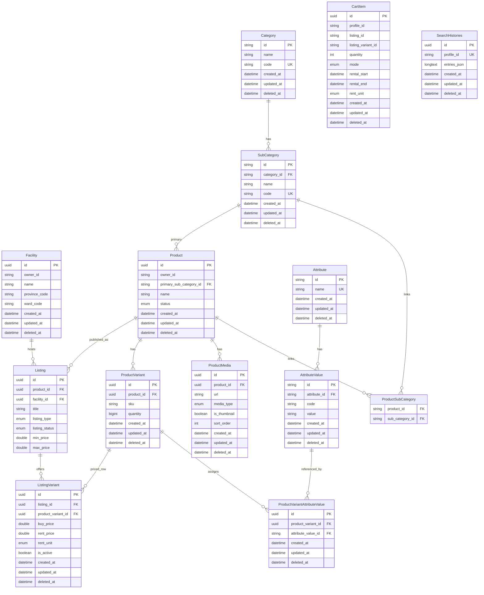
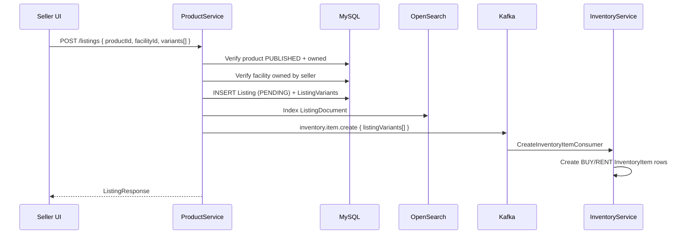
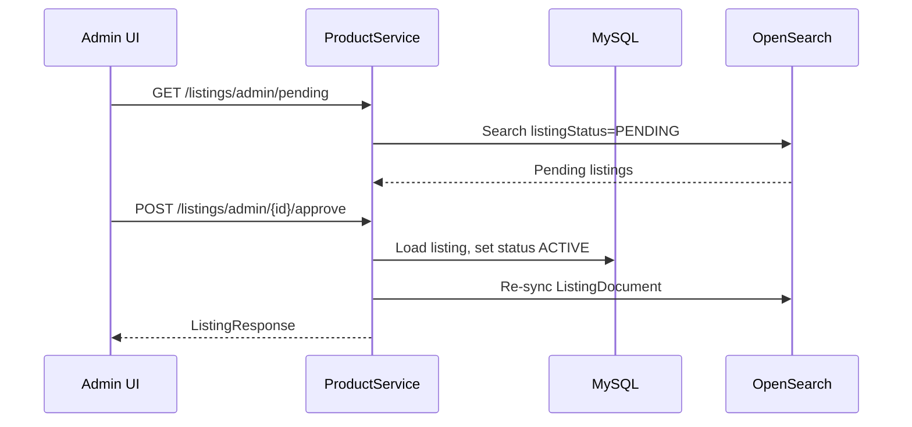
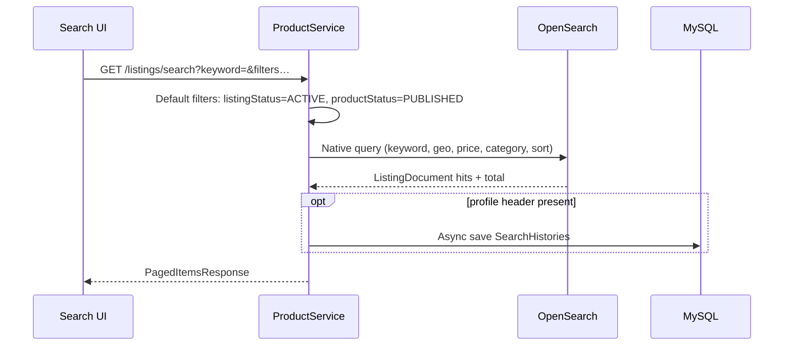
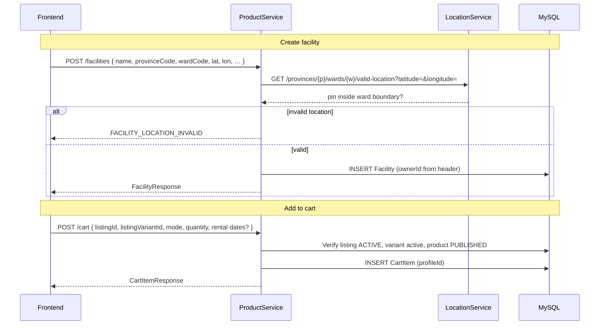

# productservice

Product catalog (`Product`, variants, attributes), facilities/warehouses (`Facility`), listings (`Listing`) per facility, and per-listing variant pricing. `Product` is owned by `owner_id` rather than being tied directly to a `Facility`. Integrates **OpenSearch** (Aiven) for search; primary persistence on MySQL.

## Stack

| Component | Version / notes |
| --- | --- |
| Java | 21 |
| Spring Boot | Web, Validation, Data JPA |
| MySQL | |
| OpenSearch | Spring Data OpenSearch (`spring-data-opensearch-starter`) + `opensearch-java` |
| Jackson YAML | |
| OpenAPI | springdoc |
| Lombok | |
| Internal deps | `commonjpa`, `commonservice` |

## Data model (JPA)

`Category` and `SubCategory` extend `CatalogItemBase` (mapped superclass: `name`, `code`, … + audit from `BaseEntity`).

**Note:** Location codes (`province_code`, `ward_code`) on `Facility` are lookup keys for `locationservice`, not JPA foreign keys.

## Main flows

Base path: `/api/v1`. OpenSearch index: `listings`. Kafka topic: `inventory.item.create`.

### Seller creates listing (PENDING → index → inventory bootstrap)

Prerequisite: product is `PUBLISHED` (`POST /products/{id}/publish`).

### Admin approves listing (PENDING → ACTIVE)

Only `ACTIVE` listings appear in public search (default filters).

### Public listing search

### Facility creation + add to cart

## Common environment variables

| Variable | Description |
|------|--------|
| `SERVER_PORT_PRODUCT_SERVICE` | HTTP port |
| `MYSQL_URL` / `MYSQL_USERNAME` / `MYSQL_PASSWORD` | Catalog database |
| `OPENSEARCH_*` / `AIVEN_*` | Search cluster connection |
| `KAFKA_BOOTSTRAP_SERVERS` | Kafka broker |
| `LOCATION_SERVICE_URL` | Ward/province validation |
