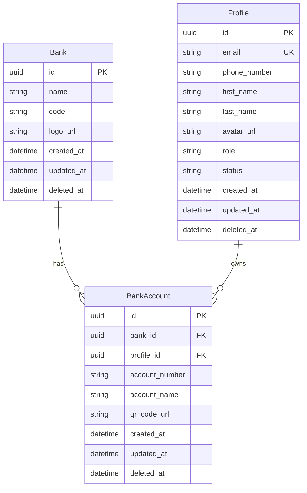

# profileservice

Quản lý hồ sơ người dùng và tài khoản ngân hàng (thanh toán): entity `Profile`, danh mục `Bank`, `BankAccount` gắn profile.

## Công nghệ

| Thành phần | Phiên bản / ghi chú |
| --- | --- |
| Java | 21 |
| Spring Boot | Web, Validation, Data JPA |
| MySQL | Connector |
| Spring Kafka | Sự kiện |
| OpenAPI | springdoc |
| Lombok | |
| Phụ thuộc nội bộ | `commonjpa`, `commonservice` |

## Mô hình dữ liệu (JPA)

