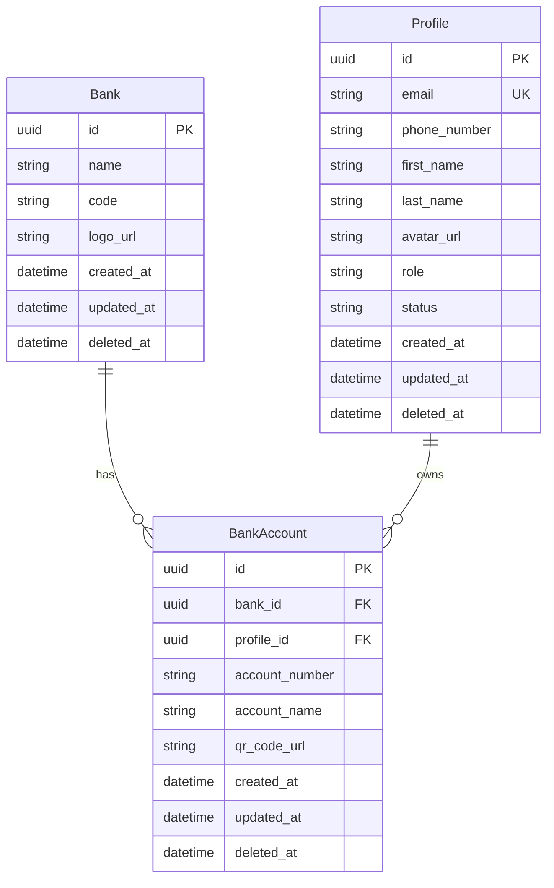
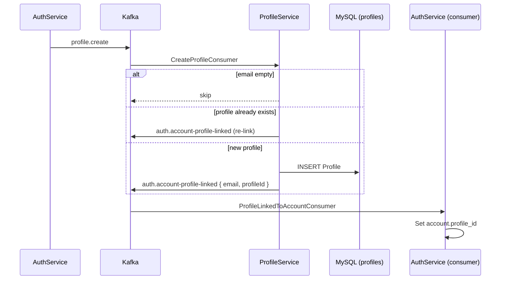
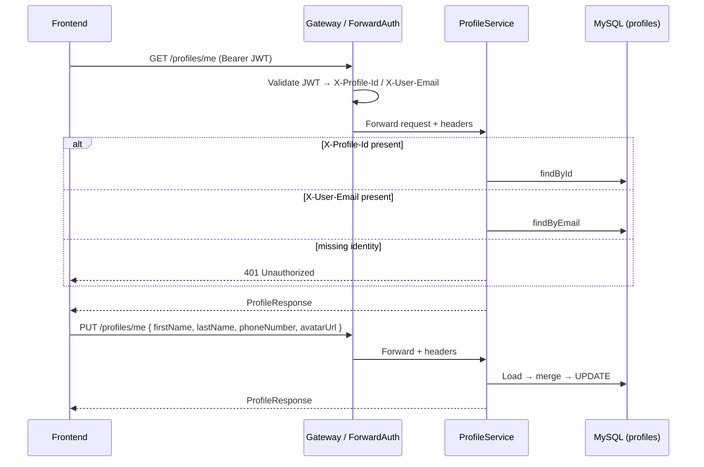

# profileservice

User profiles and bank accounts (checkout/payout): `Profile` entity, `Bank` catalog, and `BankAccount` linked to a profile.

## Stack

| Component | Version / notes |
| --- | --- |
| Java | 21 |
| Spring Boot | Web, Validation, Data JPA |
| MySQL | Connector |
| Spring Kafka | Events |
| OpenAPI | springdoc |
| Lombok | |
| Internal deps | `commonjpa`, `commonservice` |

## Data model (JPA)

**Note:** Bank account REST APIs are not implemented yet; only entities and service interfaces exist.

## Main flows

Base path: `/api/v1`. Kafka: consume `profile.create`, produce `auth.account-profile-linked`.

### Profile provisioning (signup / OAuth)

Triggered by **authservice** after local register or Google OAuth. See also [authservice README](../authservice/README.md).

### Current user profile read / update

Caller headers (`X-Profile-Id`, `X-User-Email`) are injected by Traefik forward-auth from **authservice**.

## Common environment variables

| Variable | Description |
|------|--------|
| `SERVER_PORT_PROFILE_SERVICE` | HTTP port (default `8082`) |
| `MYSQL_URL` / `MYSQL_USERNAME` / `MYSQL_PASSWORD` | Profile database |
| `KAFKA_BOOTSTRAP_SERVERS` | Kafka broker |
